# Azure Data Science Virtual Machine

[Microsoft Azure](https://azure.microsoft.com) provides a full suite of virtual machine images you can use to quickly create systems for testing or production. One of the most popular is the [Data Science Virtual Machine (DSVM)](https://azure.microsoft.com/services/virtual-machines/data-science-virtual-machines/). The DSVM has several services and components already installed, including:

- [Python](https://www.python.org/)
- [Visual Studio Code](https://code.visualstudio.com)
- [Git](https://git-scm.com/)
- [R](https://www.r-project.org/)
- [Anaconda](https://www.anaconda.com/)

While we won't be creating any machine learning models as part of this course, the VM is perfect for our use as it has the necessary components already installed. If you don't have the software setup on your local system (or don't wish to modify your system), you can create a DSVM and use the remote system for the exercises.

> **Note:** There is a cost associated with running the VM in Azure. Depending on the level of compute you select the spend for running the VM for today's workshop should be less than $2 US. To ensure you do not runup additional costs don't forget to [cleanup](cleanup.md) all resources after completion of the workshop.

## Creating an Azure account

We will be using [Azure](https://azure.microsoft.com/) for the artificial intelligence services. To follow along with the code during the workshop, you'll need an account on Azure. If you don't already have one, you can register in a couple of ways.

> **NOTE:** During the exercises you will create a key for use with Azure Cognitive Services, specifically an All-in-One key. This key is only available at the standard tier, meaning there will be some cost incurred. You can consult the [pricing documentation](https://azure.microsoft.com/pricing/details/cognitive-services/) for full information on pricing. At the time of this write-up, the cost is typically $1 US for 1,000 transactions, and we will be executing about 40 transactions. Your instructor will also provide a key for use during the event should you so desire.

### Active student

If you're an [active student](https://azure.microsoft.com/free/free-account-students-faq/), you can enroll for [Azure for Students](https://aka.ms/a4s) for **free**. Azure for Students offers $100 in credit over 12 months, and many free services for testing and learning. You can visit [Azure for Students](https://aka.ms/a4s) to enroll!

### Lifelong learner

If you're already in the industry and are expanding your skills into Azure, you can create a **free** trial account on Azure. When creating a new account you will receive $200 in credit for the first 30 days. Several free services are also included with this account for testing and learning. **No commitment** is required. You can [enroll on the Azure website](https://azure.microsoft.com/free/).

## Creating a DSVM

Let's create a DSVM via the Azure Portal.

1. [Open the DSVM blade in the Azure Portal](https://portal.azure.com/microsoft.onmicrosoft.com#create/microsoft-dsvm.dsvm-windowsserver-2016)
2. Log into Azure if required
3. Click **Start with a pre-set configuration**

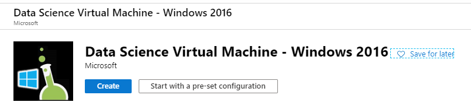

4. We're going to keep the defaults and select **Continue to create a VM** at the bottom

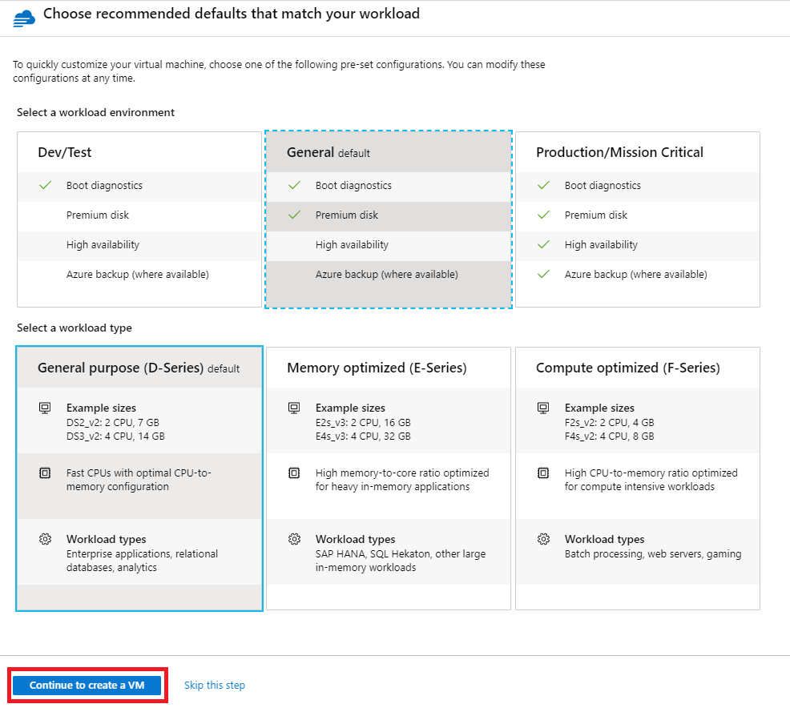

5. Configure the following options on **Create a virtual machine**
  - **Subscription**: **Azure for Students** or the subscription you wish to use
  - **Resource group**:
    - Click **Create new**
    - Enter **DSVM** as the name
  - **Virtual machine name**: **DSVM**
  - **Username**: **developer**
  - **Password**: Create a password which meets the [security requirements](https://docs.microsoft.com/azure/virtual-machines/windows/faq#what-are-the-password-requirements-when-creating-a-vm)
    - At least 12 characters long
    - At least one upper **and** one lower case letter
    - At least one digit (0-9) **and** one special character
  - Leave the defaults for all other options and click **Review + create** at the bottom of the page

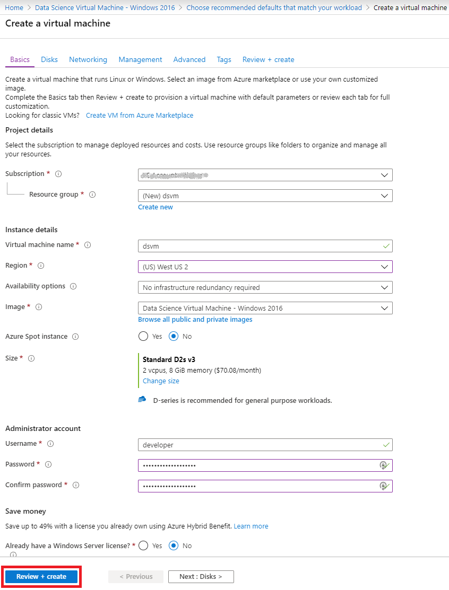

6. Review the options and click **Create**

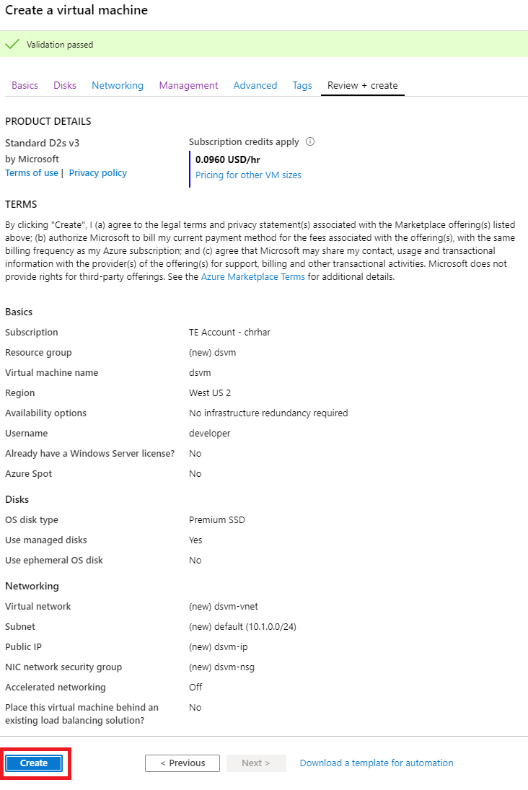

The creation process will take a few minutes. Now is the perfect time to grab a cup of coffee or tea, or to introduce yourself to the person sitting next to you.

7. When the process is complete, click **Go to resource**

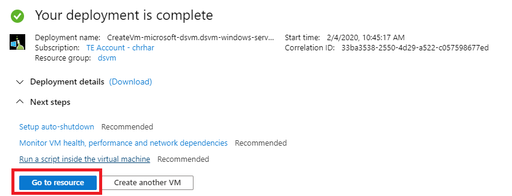

8. On the informatioon page, click **Connect**

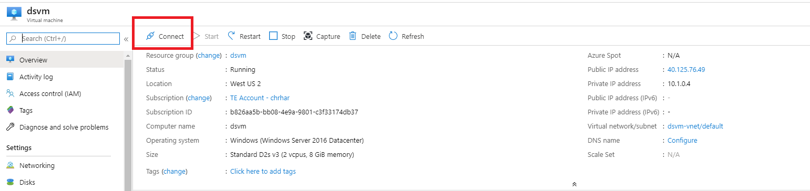

9. On the dialog, click **Download RDP file**

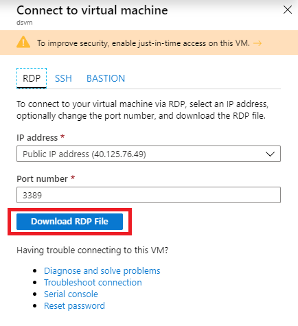

10. Open the **dsvm.rdp** file

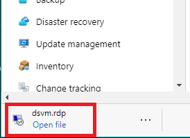

11. On the **Remote Desktop Connection** dialog check **Don't ask me again for this computer** and click **Connect**

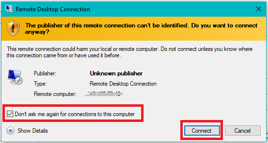

12. On the **Windows Security** dialog (yours might look a little different) choose **More choices** and then **Use a different account

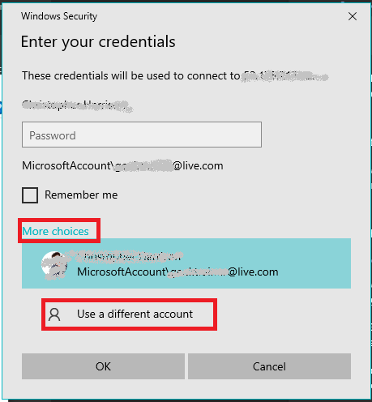

1.  Select **Remember me**, enter **developer** for the **Username**, and the **Password** you created, and click **OK** to connect

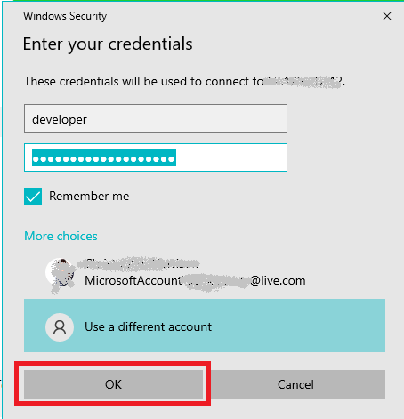

14. Select **Don't ask me again for connections to this computer** and click **Yes**

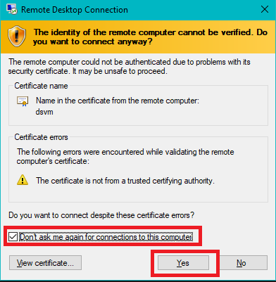

## Start developing

**Congratulations!!** You now have a VM you can use for development! **All work** can now be done inside this VM.

## Post event cleanup

**While running, the VM does incur a charge.** During the course it will be relatively nominal, but left running it can quickly run up a charge. You can either stop the VM or delete the resource group. To perform the cleanup:

- [Navigate to the cloud shell](https://shell.azure.com)
- Execute the following command to stop the VM: `az vm stop -n dsvm -g dsvm`
- Execute the following command to delete the resource group: `az group delete -n dsvm -y`

## Next step

Let's go [grab the starter site we'll be using for our project](install-starter.md).
