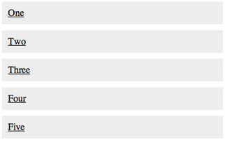
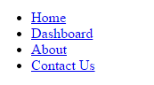

# The Display Property - Block, Inline-Block, Inline

Each HTML element by default is either **inline** or **block**.

**Inline** items only take up as much space as needed.


Inline elements: ```<a>, , <span>, <input>, <label>, <select>, <textarea>```

**Block**  items take up the 100% of the width of the parent element. Even if the width of the element is less than the parent, the element will still take up 100% of the width of the parent


Block elements: ```<body>, <div>, <form>, <h1>-<h6>, <p>, <table>, <ul>, <ol>, <li>```

**It's invalid to put block elements inside inline elements.**

Ex:
Not valid:
```<a href="http://www.bing.com">www.bing.com<h1>Bing Search</h1></a>```
Valid:
```<h1><a href="http://www.bing.com">Bing Search</a></h1>```

We can, however, change the default display style of HTML elements using CSS and the  **display property**. The possible values for display are: **inline, block, none, and inline-block**.

Ex: Inline links by default


```html
      <a href="#">One</a>
      <a href="#">Two</a>
      <a href="#">Three</a>
      <a href="#">Four</a>
      <a href="#">Five</a>
```

```css
a {
        margin: 10px;
        background: #eee;
        color: black;
        padding: 10px;
      }
```

Turning them into block elements:



```html
      <a href="#">One</a>
      <a href="#">Two</a>
      <a href="#">Three</a>
      <a href="#">Four</a>
      <a href="#">Five</a>
```

```css
      a {
        margin: 10px;
        background: #eee;
        color: black;
        display: block;
        padding: 10px;
      }
```

On the reverse side, suppose we have the following navigation menu:

``` html
<ul id="nav-menu">
  <li><a href="#">Home</a></li>
  <li><a href="#">Dashboard</a></li>
  <li><a href="#">About</a></li>
  <li><a href="#">Contact Us</a></li>
</ul>
```

The HTML would normally appear like this:



When we want to make this a horizontal menu on the top of our page, we can do this:

``` css
#nav-menu{
  list-style-type: none; /*This gets rid of the bullets.*/
}
#nav-menu li {
  display: inline;
}
```

Now it looks like this:


**Inline-block:**

Consider the following example:


Recall that `<p>` tags are block elements by default. When we display them as inline the two flow together into a single paragraph.


``` html
      <p>Lorem ipsum dolor sit amet...</p>
      <p>Lorem ipsum dolor sit amet...</p>
```

```css
      p {
        font-size: 14px;
        background: #eee;
        display: inline;
      }
```

We've now lost all ability to set our width and height since the two paragraphs are completely integrated.

The same paragraphs with inline-block:


``` css
p {
        width: 180px;
        margin:10px;
        padding:20px;
        font-size: 14px;
        background: #eee;
        display: inline-block;
      }
```

What's happening here is that we're telling the browser to display the paragraphs inline, but allow them to retain their block-level characteristics. This means we can set a width and height manually and have the two elements remain distinct, but also have them appear next to each other in the document flow.

## Vertical Align

When we start utilizing inline-block, we might notice that the vertical positioning of the blocks can start to behave differently than we might expect, particularly when the blocks have different heights. The default is for elements to be aligned to the lowest edge of the blocks within the line. To adjust this behavior, we can use the CSS property ````vertical-align````, which has values like top and middle.


## What you learned

The display property is one of the most critical properties within CSS. You should remember that block elements take up the entire width of the screen, and inline elements are going to fill in the width of the screen with as many elements that will fit in the same screen width.

NEXT: [Box Model](./box_model.md)
