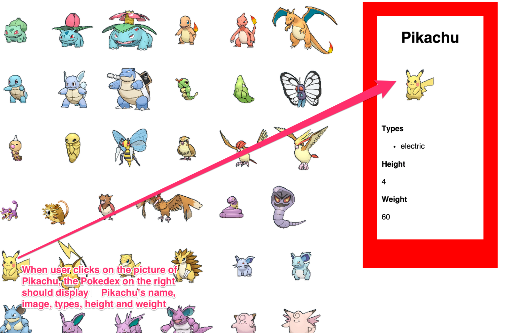

# Activity: Pokemon & Pokedex

## Part 1

Using the PokeAPI, create a page that shows the first 151 Pokemon sprite images. You can build out 151 images by hand or you can use a for-loop in JavaScript and your jQuery knowledge to produce the image tags in the body of your HTML.  If the images load slowly, consider only loading 15 images.

```html
    <!-- add http:// before the website name -->
    
    
    
    
```

Note: These images are hot-linked and may not work. Utilize the api v2 to find a sprite image that you can use to display the pokemon!

## Part 2

Add a click function to each of the Pokemon you rendered in the last PokeAPI assignment that will show the side panel pictured below.



How do you know which Pokemon was clicked? Maybe we can give each Pokemon a unique id that corresponds with their number in the URL?

```html

<!-- add http:// before the website name -->
```

So that when the image is clicked, we get its id and add it to the end of this URL: `http://pokeapi.co/api/v2/pokemon/` then we make the ajax request with that URL that we constructed.

Struggle with finding a solution for at least 30 minutes. Work with others in the workshop. If can't figure it out, then try implementing this code in your browser. Re-type it instead of just cutting and pasting so that you get familiar with every line. [Here is a working example.](https://codepen.io/dannyooooo/pen/229e50320ec54d6b8e2f845fa07672ba)

NEXT: [Deploy your pokedex to the web](./deploy.md)
