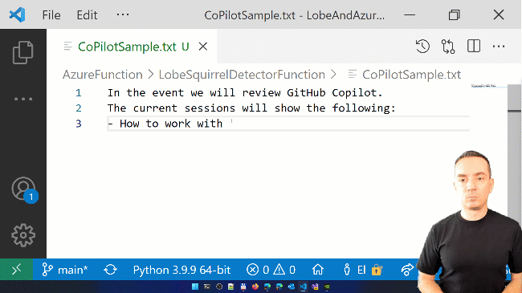

# How GitHub CoPilot 🤖 is helping in my daily work at Microsoft

March is our Artificial Intelligence and Machine Learning month in the **Microsoft Reactor Network**. 

This is the perfect time to share developer experiences working with **Visual Studio Code** and **GitHub CoPilot**.

That’s why on March we will host 5 different 30-minutes sessions, with  experiences working with:

    - Python
    - C++
    - C#
    - Markdown
    - Using CoPilot to control a Roomba vacuum cleaner 🤖 !

Happy coding!

## Sessions Registration
- [March 1st : Episode 1/5 | 🐍 Python](https://www.meetup.com/Microsoft-Reactor-Toronto/events/283606946/)
- [March 8th : Episode 2/5 | C#](https://www.meetup.com/Microsoft-Reactor-Toronto/events/283607101/)
- [March 15th : Episode 3/5 | C++](https://www.meetup.com/Microsoft-Reactor-Toronto/events/283607295/)
- [March 22nd : Episode 4/5 | MarkDown](https://www.meetup.com/Microsoft-Reactor-Toronto/events/283607390/)
- [March 29th : Episode 5/5 | Controlling a Roomba](https://www.meetup.com/Microsoft-Reactor-Toronto/events/283607416/)

## Sessions Description

    GitHub Copilot works with a broad set of frameworks and languages. Currently Copilot supports Python, JavaScript, TypeScript, Ruby, Java, and Go. However, I also used it with other languages like C++ and C#; and even while I’m writing documentation with MarkDown.
    I’m always in charge. Cycling through Copilot suggestions and manually editing the suggested code is an amazing flow. What I really like is that GitHub Copilot adapts to my own code style.
    During this series, we will review how Copilot works with Python, C++, C# and Markdown. We will also run Copilot in different coding environments like Visual Studio Code or GitHub Codespaces.
    At the end of the series, we will use Copilot suggestions to perform a cool activity: connect and control a Roomba Vacuum cleaner.

## Additional Resources

- [GitHub Copilot](https://copilot.github.com/)
- [Visual Studo Code](https://code.visualstudio.com/)
- [Microsoft Learn - Scale AI in your organization](https://aka.ms/Mar1ScaleAI)
- [Microsoft Docs - An introduction to the Azure OpenAI Service](https://aka.ms/Mar1IntrotoOpenAI)
- [Microsoft Azure - OpenAI Service (PREVIEW)](https://aka.ms/Mar1OpenAIService1)

## Speaker and Co-Host

👤 **[Bruno Capuano](http://aka.ms/elbruno)**

* Blog: https://elbruno.com
* Twitter: [@elbruno](https://twitter.com/elbruno)
* Github: [@elbruno](https://github.com/elbruno)
* LinkedIn: [@elbruno](https://linkedin.com/in/elbruno)