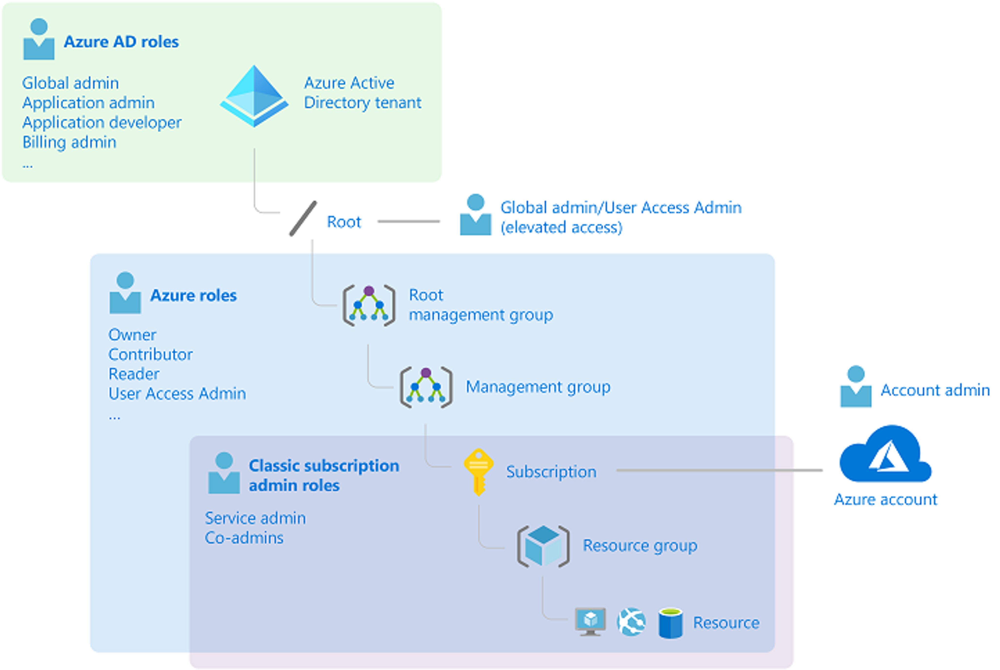

# Encadenamiento de Azure Functions mediante enlaces de entrada y salida

Repositorio de una serie basada en Azure Functions. Hay 4 sesiones individuales con información relacionada con cada sesión en una subcarpeta de este repositorio.

## ¿Quiere aprender más?

- [Concesión de acceso de usuario a los recursos de Azure mediante Azure Portal](https://docs.microsoft.com/azure/role-based-access-control/quickstart-assign-role-user-portal)
- [Protección de los recursos de Azure con el control de acceso basado en roles de Azure (Azure RBAC](https://docs.microsoft.com/learn/modules/secure-azure-resources-with-rbac/)


## ¿Cómo funciona Azure RBAC?

- Otorga acceso asignando el rol de Azure adecuado (lo que puede hacer) a usuarios, grupos y aplicaciones (quién) en un determinado ámbito. (dónde)
- El alcance de una asignación de funciones puede ser un grupo de administración, una suscripción, un grupo de recursos o un solo recurso.
- El rol de Azure que asigne determina qué recursos puede administrar el usuario, el grupo o la aplicación dentro de ese ámbito.
- Un rol asignado en un ámbito principal también otorga acceso a los ámbitos secundarios contenidos en él.

    

# Demo

## Listar accesso

1. Lista de asignaciones de role para un resource group

    ```sh 
    az role assignment list --include-inherited --resource-group {resourcegroupname} --output json --query '[].{principalName:principalName, roleDefinitionName:roleDefinitionName, scope:scope}'
    ```

2. Lista de asignaciones de roles para una usuaria

    ```sh
    az role assignment list --all --assignee {objectId}
    ```

3. Enumere las asignaciones de roles para una suscripción

    ```sh
    az role assignment list --subscription {subscriptionNameOrId}
    ```

## Asignar roles de Azure mediante la CLI de Azure


1. Determinar quién necesita acceso
    ```sh
    az ad user show --id "{principalName}" --query "objectId" --output tsv
    ```
    Podemos guardar este valor en una variable `objectId`
    ```sh
    objectId=$(az ad user show --id {principalName} --query "objectId" --output tsv)
    ```

2. Crear la asignación de rol
    ```sh
    az role assignment create --assignee {objectId} --role reader --resource-group {resourcegroupname}
    ```
3. Verifique que se haya creado la asignación

    ```sh
    az role assignment list --include-inherited --resource-group {resourcegroupname}
    ```

## Quitar roles de Azure mediante la CLI de Azure

1. Quitar rol a un usuario
    ```sh
    az role assignment delete --assignee $user --role reader --resource-group {resourcegroupname}
    ```
## Listar roles disponibles

```sh
az role definition list --custom-role-only false --output json --query '[].{roleName:roleName, description:description, roleType:roleType}'
```

