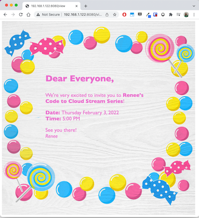

# Code to Cloud
## Web App Essentials Build-Along *(4 Episode Series)*

Getting started in web development can seem overwhelming, since there are so many different technologies to bring together! From front end to back end code, from storage to deployment, where do you even start?! 

**In this four episode series I'll take web dev back to basics, and travel the path of the essential code and tech you need to get your own web app running and accessible on the internet.**

**You'll learn how a web app comes together by:**
- Using tools like VS Code and GitHub
- Building a Python Flask server
- Coding HTML templates with CSS styling
- Using HTML forms for data collection
- Deploying a web app on Azure
- Using Azure Blob for basic data storage 

# A taste of what we’ll make!

We'll pull all these bits of tech together in a lightweight **web app that creates custom event invitations**!. 
*(for something a bit more special than a Facebook invite, for your next big event or online shindig)*

We’ll build out our app with features for data entry and storage, custom themes, and RSVP tracking for  

Come watch, collaborate, and code along with me as I build. There will be plenty of opportunity to ask questions, and even contribute your own code to my project. 
Whatever you want to create, this demo will give you the tools to get started!

See below of episode details!

**Livestreaming every Thurdsay in February / 5PM AEDT / 11:30AM IST at [MeetUp](https://www.meetup.com/en-AU/Microsoft-Reactor-Sydney/) and available on-demand on [YouTube](https://www.youtube.com/channel/UCkm6luGCS3hD25jcEhvRMIA) thereafter.**

 Date | Title | Livestream | On-demand |Resources
---       | :---   | :--- | :--- | :---
Feb 3, 2022 | **Build a Local Web App**                   |  [Register - MeetUp](https://www.meetup.com/Microsoft-Reactor-Sydney/events/283188302/)     | **Coming Soon** | [Installing VS Code and Python](https://aka.ms/pythoninstallvscode) and [Get practice with GitHub](https://aka.ms/introtogithubep1) 
Feb 10, 2022 | **Deploy a Dynamic Web App**                 |  [Register - MeetUp](https://www.meetup.com/Microsoft-Reactor-Sydney/events/283367144/)     | **Coming Soon** | [Host a web app in the cloud](https://aka.ms/Hostawebapp)
Feb 17, 2022 | **Store Data with Azure Blob**                   |  [Register - MeetUp](https://www.meetup.com/Microsoft-Reactor-Sydney/events/283388546/)     | **Coming Soon** | [Set up a storage account](https://aka.ms/createazurestorageaccount) and [Azure Blob quick tips/docs](https://aka.ms/quickstartblobs)
Feb 24, 2022 | **Build with Data From Azure Blob**                  |  [Register - MeetUp](https://www.meetup.com/Microsoft-Reactor-Sydney/events/283388652/)     | **Coming Soon** | [Azure Blob quick tips/docs](https://aka.ms/quickstartblobspython)

## Episode info

### Episode 1
**In the first episode we'll get a web app working locally that shows a custom event invitation!**

We'll start by setting up a few tools for development that will line us up for web app success!

- VS Code with Python and Flask
- A Python Virtual Environment
- A GitHub repository

Then we'll get onto coding our event invite web app by setting up our Flask server, and creating our first HTML template and CSS styes for our invitation page.

I'll then show you how you can get involved with open source projects on GitHub, so you can give coding your own themed event invitation a go and contribute it to our collection!

Come along with [VS Code and Python installed](https://aka.ms/pythoninstallvscode)!

### Episode 2
**In this episode we'll build on our web app by adding a form page so we can easily enter data about our event.  We'll also make our site go live on the internet!**

You'll learn about how HTML forms can be used to collect and post data, and how to funnel that data into filling out our invitation details and selecting an invitation style.

We'll also go through the steps on how we can deploy our app for the world to see on the internet, by integrating Azure Web Apps and GitHub!

### Episode 3
**In episodes 1 and 2, we built a working web app that can display custom event invitations, however it doesn't actually store any information. In  this episode we'll change that!**

It would be great if people could RSVP to events, so this episode we'll talk about a few storage options that are available on Azure, and what they are useful for. 

We'll implement a simple* local storage solution for our web app using files. Then we'll use Azure Blob to move that to the cloud, so our live web app has a storage solution!

**We won't be using a relational database at this stage, so we can have a play with Azure Blob, and since our scale and data needs are small. But stay tuned for a future series where I'll explore adding this.*

### Episode 4
*In the final episode, we'll make use of the event RSVP data we collected and stored in the last episode, by delving further into Azure Blob!*

We'll add some new pages to our web app to show a list of events that have been created, as well as creating a page for event organisers to show who has RSVPed "yes" for their coming event! This will give us a chance to work more with the templating features available in Flask.

If we have any spare time I'll be taking requests on bonus features we can add to finish off our beautiful web app **(for now at least)**!

 

## About the speaker - Renee Noble

Renee is the Regional Cloud Advocate for the Sydney Reactor and the Australia region. She's passionate about technology, education, community, and bringing them all together in-person and online.

A self-proclaimed "Jane of all trades", Renee has worked in sectors across tech, outreach, and education. She's worked in ML and web development in the past, dabbles in embedded tech, and is always keen to learn more!

Renee is a passionate women in tech advocate, spending her spare time leading the Girls' Programming Network to support women and girls in tech. She also runs her own business, ConnectEd Code, working to bring exciting coding opportunities to kids and teachers. Beside teaching and tech she loves swing dancing, cats, and having a ridiculous number of plants

Follow her on [LinkedIn](https://www.linkedin.com/in/renee-noble-48a37159/) and [Twitter](https://twitter.com/noble_renee).