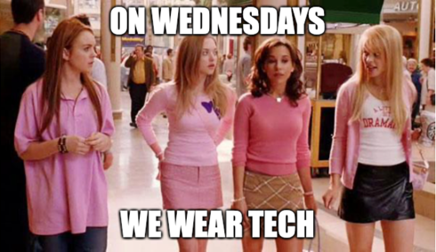

# On Wednesdays we wear tech

Smart phones were the first step in bringing the internet, data, and AI away from the desk and allowing us to be connected and sense some of the world around us wherever we go. The next step was wearables. These started as smart watches and fitness trackers, but this is slowly expanding into smart connected clothing and other devices.

In this series we learn how to build some smart wearables, leveraging the power of the cloud to make our clothes come to life along with Raspberry Pi's amazing new board, the Pi Zero W 2! Learn how to add subtitles to your speech with a smart t-shirt, light up your hoodie when people say nice things about you, or have a parrot on your shoulder that reads to you.

## Registration links

These events are run through the [Microsoft Reactor Meetup group](https://www.meetup.com/Microsoft-Reactor-Redmond/). You can register for these events on Meetup with the following links:

| Date | Episode | Meetup registration link |
| ---- | ------- | ------------------------ |
| 6th April 2022 | [Subtitle shirt](#episode-1---subtitle-shirt) | [Meetup registration link](https://www.meetup.com/Microsoft-Reactor-Redmond/events/284366501) |
| 13th April 2022 | [Be-kind-o-matic](#episode-2---be-kind-o-matic) | [Meetup registration link](https://www.meetup.com/Microsoft-Reactor-Redmond/events/284366572) |
| 20th April 2022 | [GitHub status bracer](#episode-3---github-status-bracer) | [Meetup registration link](https://www.meetup.com/Microsoft-Reactor-Redmond/events/284366744) |
| 27th April 2022 | [Reading parrot](#episode-4---reading-parrot) | [Meetup registration link](https://www.meetup.com/Microsoft-Reactor-Redmond/events/284366593) |

## Episodes

### Episode 1 - Subtitle shirt

Ever wanted to have live subtitles as you speak? What about subtitles in multiple languages?
In this first episode of Wacky Wearables, Jim shows how to build a smart t-shirt that provides a live stream of everything you say, first in your native language, then translated into a language of your choice. Using a $15 Raspberry Pi Zero W 2, a $20 LED panel, and some free AI services in the cloud you two can build your own smart subtitling t-shirt.

### Episode 2 - Be-kind-o-matic

We should all be kind, all the time. But occasionally some folks need a reminder. What if your hoodie could light up to indicate just how kind someone is being? It goes red – they know they need to start being nicer!
In this episode of Wacky Wearables, Jim shows how to use speech to text and sentiment analysis to get a feel for how positive or negative spoken sentences are, with a microphone and a Raspberry Pi Zero W 2. He then connects this to a hoodie that lights up red for negative sentiment, or green for positive.

### Episode 3 - GitHub status bracer

We’ve all been there – you're away from a computer and need to know the status of one of your GitHub repos. How many open PRs are there? Did the repo actions run successfully? If only there was a way to check this.
In this episode of Wacky Wearable, Jim builds a language model that can be used to ask questions about the status of GitHub repos. He then uses this model from a Raspberry Pi to convert spoken questions into an understood query, which he then uses to query GitHub and show the relevant status on a wrist-mounted display.

### Episode 4 - Reading parrot

Arrrgggghhh, me hearties! Every pirate needs a parrot but what if you could have one that could say more than just ‘Polly wants a cracker’, and ‘Pieces of eight’. What of your parrot could read to you?
In this episode of Wacky Wearables, Jim sticks a parrot on his shoulder (an inflatable one, not a real one), adds a camera, a Raspberry Pi Zero W 2, and teaches it how to read. Using a free AI service, this parrot can recognize both printed and hand-written text and read it out loud to you.

## Speaker

Jim is a Regional Cloud Advocate focusing on building out and skilling communities in the Pacific North West, with a focus on the Microsoft Reactor in Redmond, Washington. He’s British, so sounds way smarter than he actually is, and is happy he moved to Redmond in time to be locked down at home and not see the office he came to work in, or the places he wanted to visit. In the past he’s lived in 4 continents working as a developer in the mobile, desktop, and scientific space. He's spoken at conferences and events all around the globe, organised meetup groups and communities, and written a book on mobile development.

He also hates and is allergic to cats, but has a 9-year-old daughter who loves cats, so he has 2 cats.

You can find Jim on the following platforms:

