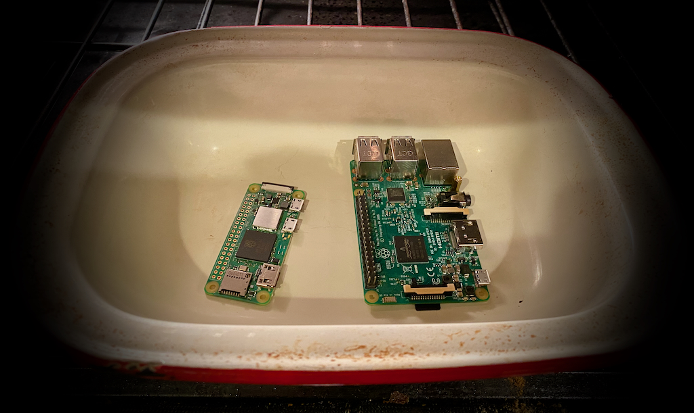

# Pi Day 2022

3/14, or the 14th of March is [Pi day](https://www.piday.org) (apologies to everyone outside the US who uses DD/MM date formats...)!

The best thing to celebrate Pi day with is, well, Pie.

The second best thing to celebrate Pi day with is the [Raspberry Pi](https://www.raspberrypi.org), one of our favorite IoT devices.

At the Microsoft Reactor we will be celebrating with a set of streams focusing on IoT built using a Raspberry Pi. Come join us using the registration links below.

| Date | Time | Session |  Register Link |
| --- | --- | :--- | :--- |
| March 14th | 11AM PT | Let's setup a Raspberry Pi as an Azure IoT device (Part1) | [Meetup](https://www.meetup.com/Microsoft-Reactor-Toronto/events/283825537) |
| March 14th | 12PM PT | Azure IoT Edge and Machine Learning 🧠 with Raspberry Pi and reTerminal (Part 2) | [Meetup](https://www.meetup.com/Microsoft-Reactor-Toronto/events/283825557?utm_medium=referral&utm_campaign=share-btn_savedevents_share_modal&utm_source=link) |
| March 14th | 3PM PT | [IoTea](../IoTea/README.md) - Leaves and Logistics |[MeetUp](https://www.meetup.com/Microsoft-Reactor-Redmond/events/283203111/) |
