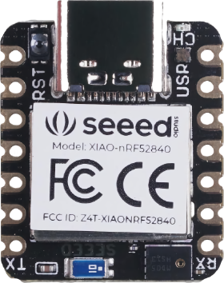

# TinyML with the Seeed XIAO

AI is no longer stuck in the cloud. Instead of relying on powerful computers with GPUs, the past few years has brought AI to small devices thanks to TinyML – machine learning models that can run on microcontrollers. You may already have devices that use this around you, from voice controlled smart speakers to fitness trackers.

In this 2-part show, Jim gets his hands dirty with TinyML, building out a fitness tracker that can distinguish between rowing and running using a small microcontroller from Seeed studios – the [Seeed XIAO BLE](https://www.seeedstudio.com/Seeed-XIAO-BLE-Sense-nRF52840-p-5253.html).

Training and deploying these models is super complicated, so Jim enlists help from [Edge Impulse](https://www.edgeimpulse.com), an online tool for capturing training data and building TinyML models.

Once Jim has his model, he will deploy it to his device using VS Code and PlatformIO, an extension for VS Code to do microcontroller development. From there he’ll deal with one of the complexities of building low powered fitness trackers, connectivity. A lot of fitness trackers use Bluetooth to sync with a phone app, so Jim will take this route, syncing fitness data to Azure IoT Central from a mobile app.

## On demand videos

This 2-part show was run through the [Microsoft Reactor Meetup group](https://www.meetup.com/Microsoft-Reactor-Redmond/). You can catch the recordings on [the Microsoft Reactor YouTube channel](https://www.youtube.com/c/MicrosoftReactor1):

| Date | Episode | Recording |
| ---- | ------- | ------------------------ |
| 23rd March 2022 | Part 1 |  |
| 30th March 2022 | Part 2 |  |

## Speaker

Jim is a Regional Cloud Advocate focusing on building out and skilling communities in the Pacific North West, with a focus on the Microsoft Reactor in Redmond, Washington. He’s British, so sounds way smarter than he actually is, and is happy he moved to Redmond in time to be locked down at home and not see the office he came to work in, or the places he wanted to visit. In the past he’s lived in 4 continents working as a developer in the mobile, desktop, and scientific space. He's spoken at conferences and events all around the globe, organised meetup groups and communities, and written a book on mobile development.

He also hates and is allergic to cats, but has a 9-year-old daughter who loves cats, so he has 2 cats.

You can find Jim on the following platforms:

