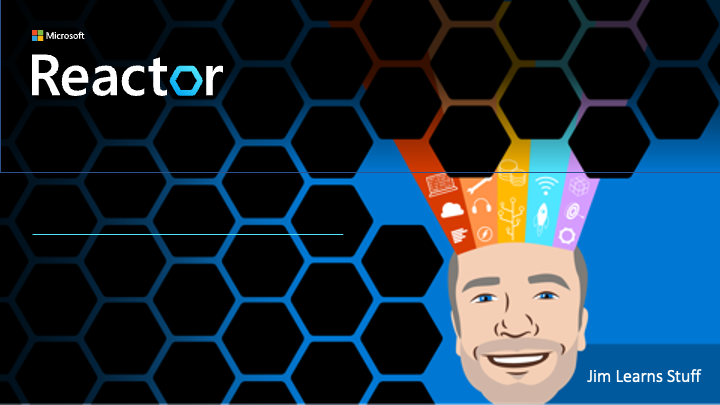

# Jim Learns Stuff

Check out this folder for past or upcoming **Jim Learns Stuff** sessions, where Jim learns.... erm... stuff!

[**Jim Learns Stuff - Jim Re-learns C++**](./jim-relearns-cpp/README.md)

---

## Speaker

Jim is a Regional Cloud Advocate focusing on building out and skilling communities in the Pacific North West, with a focus on the Microsoft Reactor in Redmond, Washington. He’s British, so sounds way smarter than he actually is, and is happy he moved to Redmond in time to be locked down at home and not see the office he came to work in, or the places he wanted to visit. In the past he’s lived in 4 continents working as a developer in the mobile, desktop, and scientific space. He's spoken at conferences and events all around the globe, organised meetup groups and communities, and written a book on mobile development.

He also hates and is allergic to cats, but has a 9-year-old daughter who loves cats, so he has 2 cats.

You can find Jim on the following platforms:

