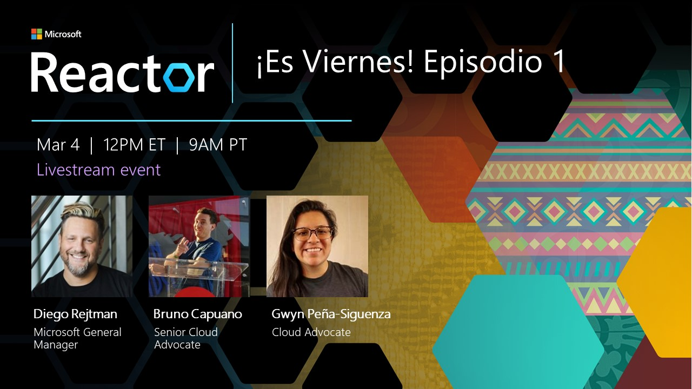
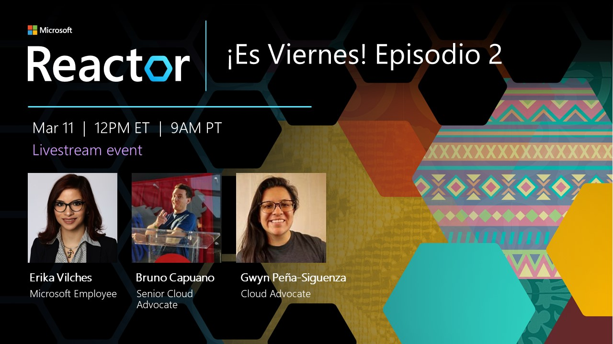
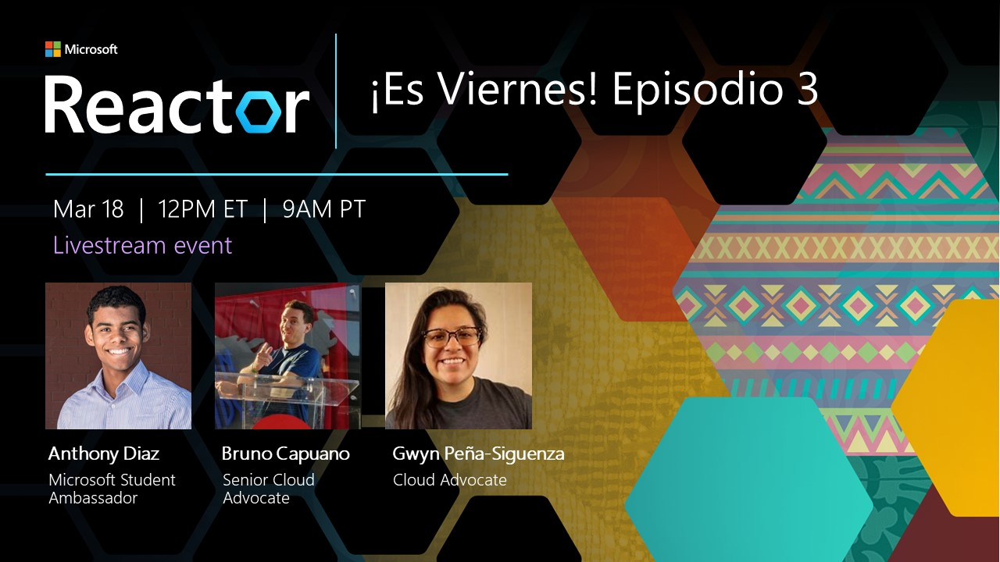
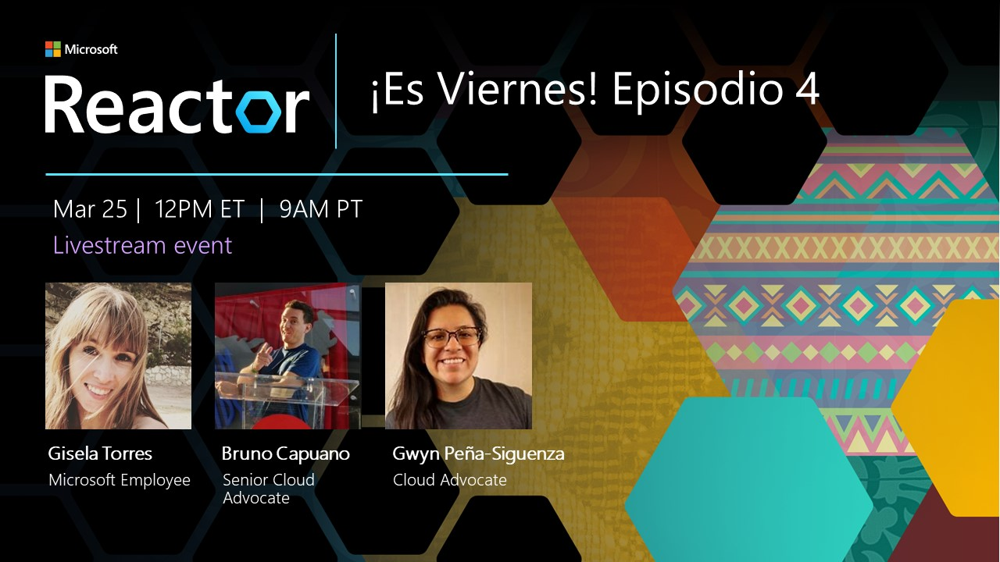

# Es Viernes !

Acompaña a Bruno y Gwyn en "¡Es Viernes!", una serie de entrevistas con expertos de Comunidades Microsoft. 

En estas sesiones, compartiremos información, anécdotas y expectativas de sobre productos Microsoft, incluidos GitHub, Azure y Visual Studio. 

Y, **¡Es Viernes!**; así que también nos divertiremos un poco 😀   

## Episodios

Episodio | Participación Especial |  Registro  | Grabación
---       | :---   | :--- | :---
  **04 Mar 2022 - [Diego Rejtman](https://twitter.com/DiegoRejtman)**|Diego Rejtman, Gerente General en Microsoft, tiene la misión personal de compartir su curiosidad y optimismo. Por 15 años Diego tuvo la oportunidad de liderar equipos de Software en la sede central de Microsoft, localizada en Seattle. Trabajó en productos como Windows y Xbox. Luego de cumplir sus sueños tecnológicos, Diego decidió inspirar a los estudiantes de todo el planeta a hacer sus sueños realidad y por 3 años lideró el equipo de reclutamiento universitario a nivel Global en Microsoft. En el 2020 Diego se sumó al equipo de Microsoft Developer Relations con el objetivo de inspirar a los desarrolladores de todo el planeta a imaginar y construir un futuro mejor.  El trabajo de Diego fue reconocido por CNET en su lista de Top 20 latinos más influenciales en Tecnología, por la fundación HACR en su lista de Top 40 Young Hispanic Corporate Achievers y por la fundación HITEC en su lista de los 100 latinos más influyentes en Estados Unidos.|  [MeetUp](https://www.meetup.com/Microsoft-Reactor-Toronto/events/283993688/)      | [Microsoft Reactor YouTube](https://aka.ms/Mar4EsViernes)
 **11 Mar 2022 - [Erika Vilches](https://twitter.com/evilches)**|Erika Vilches es Sr. Data & Applied Scientist en el grupo Cloud +AI en Microsoft. Su trabajo se centra en el desarrollo e implementación de soluciones de Big Data para el análisis de los datos de consumo de los productos y servicios que ofrece Microsoft, así como el desarrollo de modelos predictivos para anticipar las necesidades de nuestros clientes.  Antes de unirse a Microsoft, Erika obtuvo su Maestría en Inteligencia Artificial, publicó varios trabajos de investigación en artículos y revistas científicas indexadas de IEEE y Springer, y trabajó como Profesora Universitaria de Ciencias Computacionales. Actualmente, es candidata a Ph.D. en Inteligencia Artificial.|  [MeetUp](https://www.meetup.com/Microsoft-Reactor-Toronto/events/283993698/)      | [Microsoft Reactor YouTube](https://aka.ms/Mar11EsViernes)
 **18 Mar 2022 - [Antony Diaz](https://twitter.com/antonydis)**|Desde la escuela secundaria, he estado creando innovaciones como el reloj Uvolt y resolviendo problemas en las olimpiadas de matemáticas. Eso me ha permitido liderar, interactuar y aprender de equipos en Canadá, Estados Unidos, Brasil, Bolivia, Francia e India. Hoy en día, concentro mi tiempo en la resolución de problemas con datos relacionados con la educación, la ciberseguridad y la IA. para el bien social.  Durante mis estudios he sido premiado por mis iniciativas emprendedoras por Microsoft, Entrepreneurs Organization, Startup Canada, Quebecor, la Asamblea Nacional de Quebec, entre otros. He participado en misiones internacionales representando a Canadá, como la Cumbre Mundial de Desarrollo Sostenible en India, SXSW en Austin, TX, Hello Tomorrow en Francia y el Festival KIKK en Bélgica.  Además, mi interés en el desarrollo de comunidades STEM y el desarrollo sostenible me ha llevado a liderar varias iniciativas como Microsoft Learn Student Ambassador en América Latina y Canadá.|  [MeetUp](https://www.meetup.com/Microsoft-Reactor-Toronto/events/283993710/)      | [Microsoft Reactor YouTube](https://aka.ms/Mar18EsViernes)
 **25 Mar 2022 - [Gisela Torres Buitrago](https://twitter.com/0gis0)**|Me llamo Gisela Torres y trabajo en Microsoft como Cloud Solution Architect enfocada en el desarrollo de aplicaciones en la nube. Se trata de un puesto técnico cuya misión es apoyar y asesorar sobre soluciones y arquitecturas cloud, utilizando Microsoft Azure como plataforma. También soy profesora en Lemoncode {🍋}.   Pero antes de todo esto, trabajé como arquitecta de software y desarrolladora de aplicaciones en varias empresas. Durante esos años tuve la suerte de ser premiada como Most Valuable Professional en Microsoft Azure y fue poco antes cuando comencé a escribir mi blog https://www.returngis.net.|  [MeetUp](https://www.meetup.com/Microsoft-Reactor-Toronto/events/283993718/)      | [Microsoft Reactor YouTube](https://aka.ms/Mar25EsViernes)
 **01 Apr 2022 - [Diego Rejtman](https://twitter.com/DiegoRejtman)**|Diego Rejtman, Gerente General en Microsoft, tiene la misión personal de compartir su curiosidad y optimismo. Por 15 años Diego tuvo la oportunidad de liderar equipos de Software en la sede central de Microsoft, localizada en Seattle. Trabajó en productos como Windows y Xbox. Luego de cumplir sus sueños tecnológicos, Diego decidió inspirar a los estudiantes de todo el planeta a hacer sus sueños realidad y por 3 años lideró el equipo de reclutamiento universitario a nivel Global en Microsoft. En el 2020 Diego se sumó al equipo de Microsoft Developer Relations con el objetivo de inspirar a los desarrolladores de todo el planeta a imaginar y construir un futuro mejor.  El trabajo de Diego fue reconocido por CNET en su lista de Top 20 latinos más influenciales en Tecnología, por la fundación HACR en su lista de Top 40 Young Hispanic Corporate Achievers y por la fundación HITEC en su lista de los 100 latinos más influyentes en Estados Unidos.|  [MeetUp](https://www.meetup.com/Microsoft-Reactor-Toronto/events/284845965/)      | [Microsoft Reactor YouTube](https://aka.ms/Apr1EsViernes)
 **08 Apr 2022 - [Leon Welicki]( https://www.linkedin.com/in/lwelicki)**|Leon Welicki, Partner Director of Product en el equipo de Power Apps, tiene la misión personal de democratizar la construcción de aplicaciones y empoderar a todo las personas del planeta para participar en la economía de aplicaciones. Previamente, fue Partner Director of Product en Azure Core responsable de la experiencia de usuario de Azure incluyendo el framework de desarrollo de UX para todo Azure, la consola de administración de Azure (Azure Portal), Azure Mobile Apps, ecosistema de UX, telemetria y data science, patrones de UX y programas de simplificación y mejoras end-to-end de la UX de Azure. Previamente tuvo varios roles en el equipo de Workflow Foundation (.Net y Cloud). Leon es inventor en 20 patentes de software en los ámbitos de lenguajes de programación, experiencia de usuario y sistemas distribuidos. Originalmente de Argentina, vivió en Madrid, España donde completo un Doctorado en Ingenieria del Software, trabajo en desarrollo de software en una empresa de telecomunicaciones, e impartió clases de master y doctorado.|[MeetUp](https://www.meetup.com/Microsoft-Reactor-Toronto/events/285082536/)      | [Microsoft Reactor YouTube](https://aka.ms/Apr8EsViernesEp6)
 **22 Apr 2022 - Tania Mariscal y Mariana Briones**| [Tania Mariscal](https://www.tiktok.com/@taniamarquin) - ¡Hola! Mi nombre es Tania Mariscal Quintana. Soy originaria de Chihuahua, México. Después de haber vivido y estudiado en México hasta los 17 años, conseguí becas en Estados Unidos para estudiar mi universidad acá. Me gradué con dos licenciaturas en Economía y Finanzas de la Universidad de Texas en El Paso (UTEP). Actualmente, trabajo en Microsoft como Program Manager en Business Operations (Operaciones de Negocios). Antes de trabajar en Microsoft, trabaje en Dell en su grupo de Investor Relations y en Wall Street en BlackRock. Este año terminó mi programa rotational en Microsoft.  Me encanta viajar y conocer nuevas culturas. He vivido en Colombia, Brasil y Francia. Y también he viajado a más de 15 países de mochilera. Adoro a los animales y rescato gatitos con mi hermana en nuestro tiempo libre. Comparto de mis experiencias como Latina en Tech y Mexicana por el mundo en mi TikTok @taniamarquin.  [Mariana Briones](https://www.linkedin.com/in/marianabriones/) - Soy Mariana Briones, y estoy por cumplir mi segundo añoo trabajando para Microsoft. Creci en la frontera de Ciudad Juarez, Mexico y El Paso, Texas y me gradue de la Universidad de Texas en El Paso con una licenciatura en Ingenieria Electrica y Computacion en Mayo del 2020. Antes de empezar a trabajar en Microsoft de tiempo completo, fui practicante en Cummins y en Microsoft Surface. Actualmente trabajo como Product Manager en el equipo de Office Web. Fuera de mi vida laboral, me gusta apoyar causas que me apasionen. Mi proyecto mas reciente ayudaba a dar recursos a estudiantes que querian conseguir pasantias/internships. Este proyecto es llamado Internmakers y aunque ya no esta tan activo como antes, sigue teniendo recursos y consejos en Youtube e Instagram que pueden aplicarse hoy en dia. Ademas de esto, en mi tiempo libre veo y leo muchas cosas sobre moda y amo convivir con mis seres queridos.| [MeetUp](https://www.meetup.com/Microsoft-Reactor-Toronto/events/285227378/) | [Microsoft Reactor YouTube](https://aka.ms/Apr22EsViernesEp7)
 **29 Apr 2022 - Gabriel Esparza-Romero**|[Gabriel Esparza-Romero](https://www.linkedin.com/in/gabriel-esparza-romero-0aa47695/). Gabriel ha estado 23 años en Microsoft y es actualmente un Partner Group Software Engineering Manager en Azure Cost Management. Su equipo está en Redmond Washington y en México. Gabriel ha estado involucrado con la comunidad Hispana\Latinx en la compañía por varios años. Es originario de Oaxaca, en sur de México.|[MeetUp](https://www.meetup.com/Microsoft-Reactor-Toronto/events/285101991/) | [Microsoft Reactor YouTube](https://aka.ms/Apr29EsViernesEp8)

## Nuestros Anfitriones

  |  **[Bruno Capuano](http://aka.ms/elbruno)** |  **[Gwyneth Pena-Siguenza](https://developer.microsoft.com/en-us/advocates/gwyneth-penasiguenza)**
---       | :---   | :--- 
Twitter | [@elbruno](https://twitter.com/elbruno) | [@madebygps](https://twitter.com/madebygps)
Github | [@elbruno](https://github.com/elbruno) | [@madebygps](https://github.com/madebygps)
LinkedIn | [ Bruno Capuano (He/Him) ](https://linkedin.com/in/elbruno) | [ Gwyneth Peña-Siguenza (She/Her)](https://www.linkedin.com/in/gwyneth-pena/)
