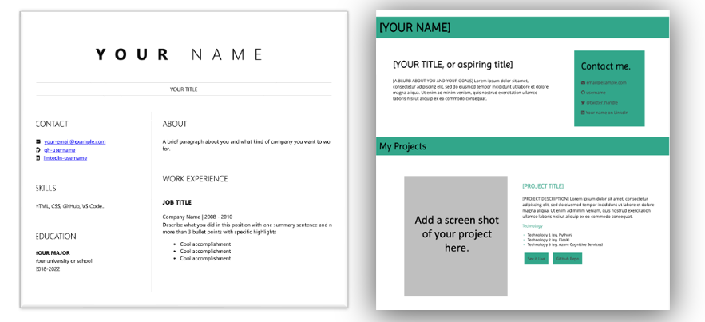
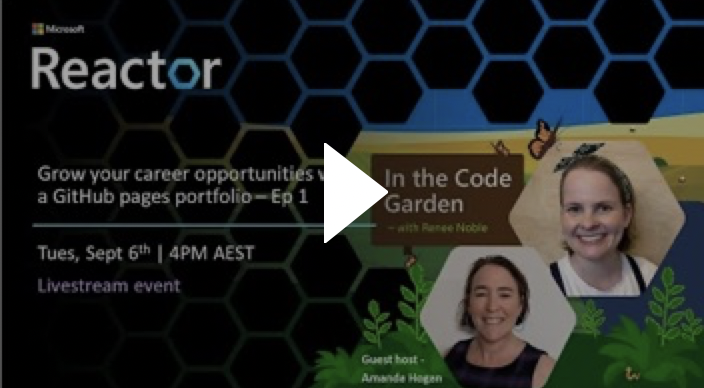
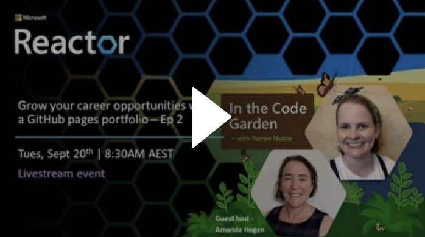

# UTS Tech Fest - Empowering Women in IT
## **Build your career with a portfolio or resume website**

 

### **Intersted in becoming a Microsoft Learn Student Ambasador?**
Join our upcoming session on how to apply, on Monday July 10th at 4pm. 
[Register here](https://aka.ms/MLSA-Information-Session)

Find out more about the [program here](https://aka.ms/UTS-techfest-MSLA). 

 

## Your links for today's session

 

### **GitHub Copilot - Get access!**
Use the [GitHub Student Developer Pack](https://education.github.com/pack?WT.mc_id=academic-99714-reneenoble) to get access to GitHub Copilot and more for free!

To get access later follow this [blog](https://techcommunity.microsoft.com/t5/educator-developer-blog/step-by-step-setting-up-github-student-and-github-copilot-as-an/ba-p/3736279?WT.mc_id=academic-99715-reneenoble).

 

### **Resources for today's workshop**
Use the [workshop resources here](https://github.com/microsoft/workshop-library/tree/main/full/build-resume-website?WT.mc_id=academic-99716-reneenoble) to make a resume.

Use the [template here](https://github.com/in-the-code-garden/portfolio-template?WT.mc_id=academic-99717-reneenoble) to start on a portfolio.

 

### **Want more information?**

**Join the [Cloud Skills Challenge here](https://learn.microsoft.com/training/challenges?id=2fdd46dd-8ccd-47ad-a840-9ee0cef322eb&WT.mc_id=academic-99719-reneenoble)** to learn more about Copilot, GitHub, Front End Development, and VS Code.

**Watch my videos on [front end development here](https://www.reneenoble.com/code-garden#block-yui_3_17_2_1_1659417996477_56685?WT.mc_id=academic-99718-reneenoble)**, to learn more about HTML, CSS, and JavaScript.

**Check out my recordings** on how to make a portfolio (and make it stand out). 

***Episode 1:*** First  steps to creating a portfolio site with GitHub pages

In episode 1 we'll cover the basics of how to get your portfolio site set up and make it go live with GitHub pages! 

Will give you the steps you need to get from getting start with GitHub, to portfolio structure, to making it go live!

 

***Episode 2:*** Bring style and substance to your GitHub pages portfolio

We'll take our basic website from episode 1 and focus on making it stand out, by giving you tips on the content to include, and how to make it stand out from the crowd with HTML and CSS skills. 
