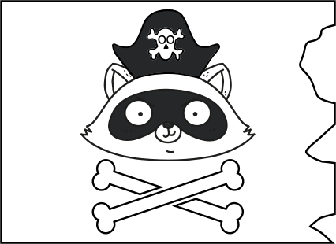

# Sea of Nerds

🏴‍☠️ Arrrrrrr, ye swarthy land lubbers. Come set sail with your pirate captain, the Dread Pirate Jim and his pirate crew as we sail the seven seas to find the finest treasure in the land – knowledge!

💰 In this series our trusty pirates set sail on the [Sea of Thieves](https://www.seaofthieves.com), and share their galleon with a range of special guests from across the tech industry. Each episode will mix sharing tales of tech quests large and small to pass the time whilst we sail, with intense piratical action as we try to claim treasure.

🎮 This is the only series from the Microsoft Reactor where you can both learn how folks have achieved greatness in their fields, whilst watching how good or terrible they are at video games.

⚓️ So come join our crew, bring your questions for our guests, and let's all [#BeMorePirate](https://twitter.com/hashtag/BeMorePirate?src=hashtag_click)!

## Session registrations

| Date/Time | Registration link |
| --------- | ----------------- |
| 3rd March, 9am PT | [meetup.com/Microsoft-Reactor-Redmond/events/283812139](https://www.meetup.com/Microsoft-Reactor-Redmond/events/283812139) |
| 10th March, 9am PT | [meetup.com/Microsoft-Reactor-Redmond/events/283812213](https://www.meetup.com/Microsoft-Reactor-Redmond/events/283812213) |
| 17th March, 9am PT | [meetup.com/Microsoft-Reactor-Redmond/events/283812234](https://www.meetup.com/Microsoft-Reactor-Redmond/events/283812234) |

## Sessions

### 3rd March - educators at Microsoft 👩‍🏫

A good pirate crew supports the next generation of pirates, providing them with training and opportunities to terrorize the seven seas and seize treasure. Microsoft is the same – at Microsoft there is a strong focus on the next generation of developers ensuring they have the support and opportunities to not only grow their tech skills but demonstrate these skills in ways that increase their employability or use their skills to empower their peers.

For this session, our crew is joined by Jennifer Ritzinger, the General Manager of the Next Generation Experiences team at Microsoft, and Pablo Veramendi, director of audience evangelism and the brains behind the Microsoft Learn Student Ambassador and Imagine Cup programs.

We will be digging up treasure whilst discussing topics including the career backgrounds for our guests, how Microsoft is upskilling students and educators, how students can help their peers and increase their employability via the Microsoft Learn student ambassador program, and how teams of students all around the world can win many pieces of eight by bringing their ideas to the Imagine Cup.

#### Show links

- [Microsoft Learn Student Ambassadors](https://studentambassadors.microsoft.com)
- [Microsoft Reactors on GitHub](https://github.com/microsoft/Reactors)
- [Microsoft Reactors on YouTube](https://aka.ms/ReactorYouTube)
- [Microsoft Imagine Cup](https://imaginecup.microsoft.com/)
- [Microsoft Learn for Students](https://aka.ms/MSLearnforStudent)
- [Microsoft Learn for Educators](https://aka.ms/MSLearnEducators)

### 10th March - educators 🎓

Pirates need to learn the ropes before they can successfully contribute to a crew, and games developers are no different!

In this episode our crew is joined by Professor Chris Headleand, the head of the department of games design and technology at Staffordshire University in the UK.

As our crew quest for gold, they will be talking about topics including learning games development, how to get internships and jobs with games companies, what tools there are to help you create games, and more!

#### Show links

- [Xbox Game Pass](https://www.xbox.com/xbox-game-pass)
- [Engaging with students via playing video games](https://aka.ms/EngagingViaVideoGames)
- [Using your Xbox for learning](https://aka.ms/XboxforLearning)
- [MakeCode Arcade](https://arcade.makecode.com)
- [Azure PlayFab](https://aka.ms/PlayFabMSAzure)
- [PlayFab docs](https://aka.ms/PlayFabAzureDoc)

### 17th March - interns and graduates 👩‍🎓

Every good pirate in training takes time to sail with a crew, before committing to a captain once their training is complete. Students are the same – doing internships to try out companies and jobs before they commit to their first graduate role.

For this session, our crew is joined by a couple of young pirates who interned at Microsoft in different ways before taking graduate roles with the company. Eleanor Lewis started as an in-person intern on the Microsoft Redmond campus, a role that left her literally singing and dancing with joy. She is now a software engineer who Excels! Gustavo Cordido joined under more locked down circumstances, doing a virtual internship at the start of the pandemic. That experience didn’t put him off a life on the ocean waves, and he joined Microsoft as a developer advocate when he graduated.

As these fresh-faced pirates help us find where X marks the spot and dig for buried treasure, we will be discussing tech internships, what students are looking for in an internship experience and how tech companies can support them. We will also be exchanging tales of graduate recruitment, interview panels and what fun activities Microsoft had in store for them both as interns.

- [Microsoft Careers](https://careers.microsoft.com/)
- [Student and graduate careers](https://careers.microsoft.com/students/)
- [Microsoft the Musical](https://youtu.be/ZGeWNR8CWnA)
- [Microsoft Garage internships](https://www.microsoftnewengland.com/garage/)
- [Start in tech as an intern on Microsoft Learn](https://aka.ms/TechAsAnIntern)
- [Build your tech resilience on Microsoft Learn](https://aka.ms/BuildTechResilience)
