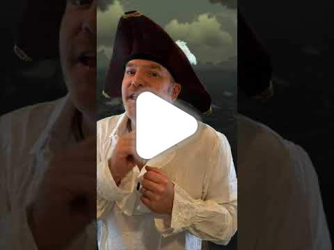
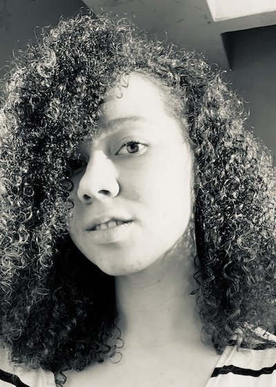
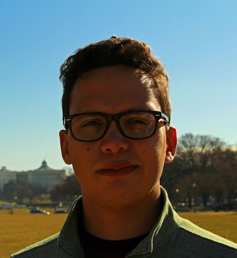
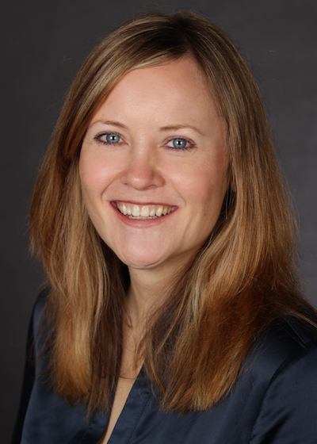

# Sea of Nerds

🏴‍☠️ Arrrrrrr, ye swarthy land lubbers. Come set sail with your pirate captain, the Dread Pirate Jim and his pirate crew as we sail the seven seas to find the finest treasure in the land – knowledge!

💰 In this series our trusty pirates set sail on the [Sea of Thieves](https://www.seaofthieves.com), and share their galleon with a range of special guests from across the tech industry. Each episode will mix sharing tales of tech quests large and small to pass the time whilst we sail, with intense piratical action as we try to claim treasure.

🎮 This is the only series from the Microsoft Reactor where you can both learn how folks have achieved greatness in their fields, whilst watching how good or terrible they are at video games.

⚓️ So come join our crew, bring your questions for our guests, and let's all [#BeMorePirate](https://twitter.com/hashtag/BeMorePirate?src=hashtag_click)!

## Session registrations

| Date/Time | Registration link |
| --------- | ----------------- |
| 10th March, 9am PT | [meetup.com/Microsoft-Reactor-Redmond/events/283812213](https://www.meetup.com/Microsoft-Reactor-Redmond/events/283812213) |
| 17th March, 9am PT | [meetup.com/Microsoft-Reactor-Redmond/events/283812234](https://www.meetup.com/Microsoft-Reactor-Redmond/events/283812234) |
| 24th March, 9am PT | [meetup.com/Microsoft-Reactor-Redmond/events/283812139](https://www.meetup.com/Microsoft-Reactor-Redmond/events/283812139) |

## Sessions

### 10th March - educators 🎓

Pirates need to learn the ropes before they can successfully contribute to a crew, and games developers are no different!

In this episode our crew is joined by Professor Chris Headleand, the head of the department of games design and technology at Staffordshire University in the UK.

As our crew quest for gold, they will be talking about topics including learning games development, how to get internships and jobs with games companies, what tools there are to help you create games, and more!

#### Crew

**Professor Chris Headleand**

#### Show links

- [Xbox Game Pass](https://www.xbox.com/xbox-game-pass)
- [Engaging with students via playing video games](https://aka.ms/EngagingViaVideoGames)
- [Using your Xbox for learning](https://aka.ms/XboxforLearning)
- [MakeCode Arcade](https://arcade.makecode.com)
- [Azure PlayFab](https://aka.ms/PlayFabMSAzure)
- [PlayFab docs](https://aka.ms/PlayFabAzureDoc)

### 17th March - interns and graduates 👩‍🎓

Every good pirate in training takes time to sail with a crew, before committing to a captain once their training is complete. Students are the same – doing internships to try out companies and jobs before they commit to their first graduate role.

For this session, our crew is joined by a couple of young pirates who interned at Microsoft in different ways before taking graduate roles with the company. Eleanor Lewis started as an in-person intern on the Microsoft Redmond campus, a role that left her literally singing and dancing with joy. She is now a software engineer who Excels! Gustavo Cordido joined under more locked down circumstances, doing a virtual internship at the start of the pandemic. That experience didn’t put him off a life on the ocean waves, and he joined Microsoft as a developer advocate when he graduated.

As these fresh-faced pirates help us find where X marks the spot and dig for buried treasure, we will be discussing tech internships, what students are looking for in an internship experience and how tech companies can support them. We will also be exchanging tales of graduate recruitment, interview panels and what fun activities Microsoft had in store for them both as interns.

#### Crew

**Eleanor Lewis**

Eleanor is a Software Engineer focusing on accessibility in tech. She spent 3 internships with Microsoft working on different teams in Excel. Outside of work her passions are reading and dancing. She usually reads anywhere between 30 to 50 books a year, typically fiction but in a multitude of genres. And she has been dance training for 21 years both at a performing arts school in middle school and high school, and with a Dance Minor in college. But now she just dances for fun.

**Gustavo Cordido**

Gustavo is a Cloud Advocate in Spatial Computing. He joined Microsoft as an intern in Summer of 2020 and returned as a Full Time Employee in January of 2021. He currently works in creating curriculum directed at introducing XR to students and developers alike, as well as partnering with academic institutions to support their developments in Mixed, Augmented and Virtual Reality. His hobbies are cooking and hiking, but enjoys playing videogames to keep up with long-distance friendships. You can connect with Gustavo on [LinkedIn](https://www.linkedin.com/in/gcordidoa/) and [Twitter](https://twitter.com/gcordidoa).

#### Show links

- [Microsoft Careers](https://careers.microsoft.com/)
- [Student and graduate careers](https://careers.microsoft.com/students/)
- [Microsoft the Musical](https://youtu.be/ZGeWNR8CWnA)
- [Microsoft Garage internships](https://www.microsoftnewengland.com/garage/)
- [Start in tech as an intern on Microsoft Learn](https://aka.ms/TechAsAnIntern)
- [Build your tech resilience on Microsoft Learn](https://aka.ms/BuildTechResilience)

### 24th March - educators at Microsoft 👩‍🏫

A good pirate crew supports the next generation of pirates, providing them with training and opportunities to terrorize the seven seas and seize treasure. Microsoft is the same – at Microsoft there is a strong focus on the next generation of developers ensuring they have the support and opportunities to not only grow their tech skills but demonstrate these skills in ways that increase their employability or use their skills to empower their peers.

For this session, our crew is joined by Jennifer Ritzinger, the General Manager of the Next Generation Experiences team at Microsoft, and Pablo Veramendi, director of audience evangelism and the brains behind the Microsoft Learn Student Ambassador and Imagine Cup programs.

We will be digging up treasure whilst discussing topics including the career backgrounds for our guests, how Microsoft is upskilling students and educators, how students can help their peers and increase their employability via the Microsoft Learn student ambassador program, and how teams of students all around the world can win many pieces of eight by bringing their ideas to the Imagine Cup.

#### Crew

**Jennifer Ritzinger**

Jennifer Ritzinger has been with Microsoft for 25 years, spending much of that time in the dynamic world of developer relations. She leads the Next Generation Experiences team, including driving the mission of skilling the next generation of developers, curating regional advocacy in global markets, overseeing the Microsoft Reactors, local hubs for developer outreach, and steering the Developer Studio, which produces award winning digital storytelling through hundreds of events and shows within Cloud + AI engineering. Previously, Jennifer led Microsoft’s marquee events including Build, the Professional Developers Conference, TechEd, and MIX.  She is the former co-host of a web series, WM_IN, featuring amazing females in the high-tech industry, and was a regular host of a web series featuring the team behind the scenes at Microsoft. She’s also a previous facilitator for Microsoft’s new employee orientation, imparting key company information and excitement to new recruits. Before joining Microsoft, Jennifer was a secondary school educator, teaching high school English.

**Pablo Veramendi**

Pablo has spent the past 20 years leveraging technology to empower others to achieve more. For the past seven years he has been leading Microsoft’s global Imagine Cup student technology competition where competitors bring their dreams to life and compete on a world stage. Over the past three years he has led the Microsoft Learn Student Ambassador program which consists of on-campus leaders with a passion for making a difference, building vibrant communities, and sharing the latest tech with their peers. He believes that the future is in the hands of these incredibly talented students and he is honored and humbled to work at Microsoft to give all students opportunities to achieve more. 

#### Show links

- [Microsoft Learn Student Ambassadors](https://studentambassadors.microsoft.com)
- [Microsoft Reactors on GitHub](https://github.com/microsoft/Reactors)
- [Microsoft Reactors on YouTube](https://aka.ms/ReactorYouTube)
- [Microsoft Imagine Cup](https://imaginecup.microsoft.com/)
- [Microsoft Learn for Students](https://aka.ms/MSLearnforStudent)
- [Microsoft Learn for Educators](https://aka.ms/MSLearnEducators)
