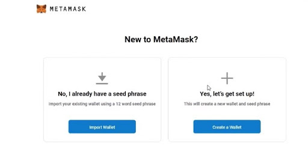

# Getting setup

In this section, we will focus on the following:

- [What is Remix?](#what-is-remix?)
- [Get started with Remix](#get-started-with-remix)
- [What is MetaMask Plug-in?](#what-is-metaMask-plug-in?)
- [Download MetaMask](#download-metaMask)
- [Add MetaMask](#add-metaMask)
- [Get Started with MetaMask](#get-started-with-metaMask)
- [Create a Wallet](#create-a-wallet)
- [Secret Backup Phrase](#secret-backup-phrase)
- [Why do Testnets Exist](#why-do-testnets-exist)
- [What is a faucet and how to use the Kovan faucet](#what-is-a-faucet-and-how-to-use-the-kovan-faucet)
- [Request Kovan Ether](#request-kovan-ether)

## What is Remix?

Remix is an online IDE (Integrated Development Environment) you can use to write smart contracts. You can compile, test and deploy them for free. You can use Remix both online and offline.

## Get started with Remix

1. Go to https://remix.ethereum.org/
2. Create a new file by clicking on the `+` button next to the browser folder and name it **Shipping.sol**.
3. Copy + paste the code from the Shipping contract below.
4. In the left side-bar, select the second option to take you to the Solidity Compiler.  Press the button to **Compile Shipping.sol**.
5. Go to the deploy & run transactions section (the third option down in the side-bar). Leave the environment as JavaScript VM and the select to deploy the contract.

Now you can explore the deployed contract and interact with it and its functions.

```solidity
pragma solidity >=0.5.16<=0.7.0;

contract Shipping
{
    // Our predefined values for shipping listed as enums
    enum ShippingStatus { Pending, Shipped, Delivered }

    // Save enum ShippingStatus in variable status
    ShippingStatus private status;

    // Event to launch when package has arrived
    event LogNewAlert(string description);

    // This initializes our contract state (sets enum to Pending once the program starts)
    constructor() public {
        status = ShippingStatus.Pending;
    }

    // Function to change to Shipped
    function Shipped() public {

        status = ShippingStatus.Shipped;
    }

    // Function to change to Delivered
    function Delivered() public {
        status = ShippingStatus.Delivered;
        emit LogNewAlert("Your package has arrived");

    }

    // Function to get the status of the shipping
    function getStatus(ShippingStatus _status) internal pure returns (string memory) {

     // Check the current status and return the correct name
     if (ShippingStatus.Pending == _status) return "Pending";
     if (ShippingStatus.Shipped == _status) return "Shipped";
     if (ShippingStatus.Delivered == _status) return "Delivered";

}

    // Get status of your shipped item
    function Status() public view returns (string memory) {
         ShippingStatus _status = status;
         return getStatus(_status);
    }

}
```

## What is MetaMask Plug-in?

Metamask itself is a cryptocurrency wallet. Metamask also is a plug-in that will bring Ethereum to your browser. Metamask does so by making a window.web3 and window.ethereum object available that helps your browser communicate with the blockchain.
Y
ou can choose to connect to the Main Ethereum Network as well as test networks.
As a user you can use it as a crypto wallet to store ether, and for developers it is mainly used to deploy smart contracts. Let’s see how metamask plugin and remix work together to make smart contract development low barrier to entry and a breeze.
> NOTE: if you use MetaMask as a wallet and as a dev tool, it’ll be more secure to make 2 separate accounts.
It's security best practice to avoid accidentally leaking your addresses / keys etc... in screenshots for example. 
It's also helpful to avoid mistakes where you accidentally use the mainnet / real wallet / real crypto assets instead of the testnet.
If your dev only account is compromised... no big deal... just make a new one.
Your real wallet contains crypto assets that has monetary value etc...
If your real address gets associated with your identity... at the very least this gives others a way to study your transaction patterns which you would want to avoid.

## Download MetaMask

You can [download MetaMask](https://metamask.io/download.html) using Firefox, Chrome or [Brave](https://brave.com/) browsers.


## Add MetaMask

- You will be redirected to add the extension.


- Click Add extension


## Get Started with MetaMask

You will see Welcome to MetaMask when the extension is launched. Click **Get Started**.


## Create a Wallet

If you are new to Metamask you will create a wallet and set a new password. Click **Create a Wallet**.


# Secret Backup Phrase

- Set a new password. You will now get a Secret Backup Phrase. Important! Make sure to store this Secret Backup Phrase somewhere safe since you can not get a hold of it if you do not save it.


- Confirm your Secret Backup Phrase. After this step you are done with the set up and connected to the main Ethereum network!


## Why do Testnets Exist

When we are learning how to code smart contracts, we have the option to use test nets to do transactions without paying for it.

Test nets run in parallel and are in most cases identical with the mainnet (the real net) but the tokens used are different (even though they might work the same way i.e. monopoly money vs real money, you can still use it to buy things but not in real life :)

This means we can learn and see how it will work in real production without spending any money. This also means that we have NO EXCUSE to not test our contracts and audit them carefully.

There are different test nets in MetaMask, for this workshop we will use the **Kovan test Network**.

## What is a faucet and how to use the Kovan faucet

Faucet makes it possible for you to get test ether to use for a test network. It has no real value and you are not paying anything to use it. When you have set-up MetaMask you can change from **Main Ethereum Network** to **Kovan Test Network**.


## Request Kovan Ether

- You can request Kovan Ether through your GitHub account
- You will need your address from MetaMask
- You can submit your address to the [Kovan network faucet](https://faucet.kovan.network/)using your GitHub account to get test Ether, referred to as KETH.
- You can also get Kovan Ether through Gitter by using GitLab, Twitter or GitHub as a login. Go to the [Gitter account](https://gitter.im/kovan-testnet/faucet) and paste your address in a chat to request KETH.
- More information about Kovan Faucet can be found [in their GitHub repo](https://github.com/kovan-testnet/faucet/blob/master/README.md).


