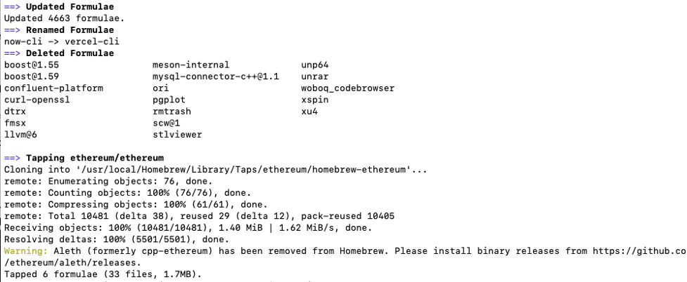
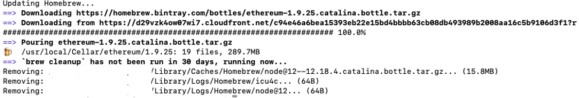
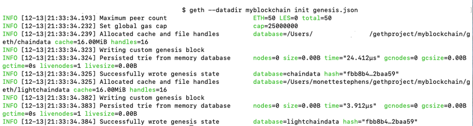
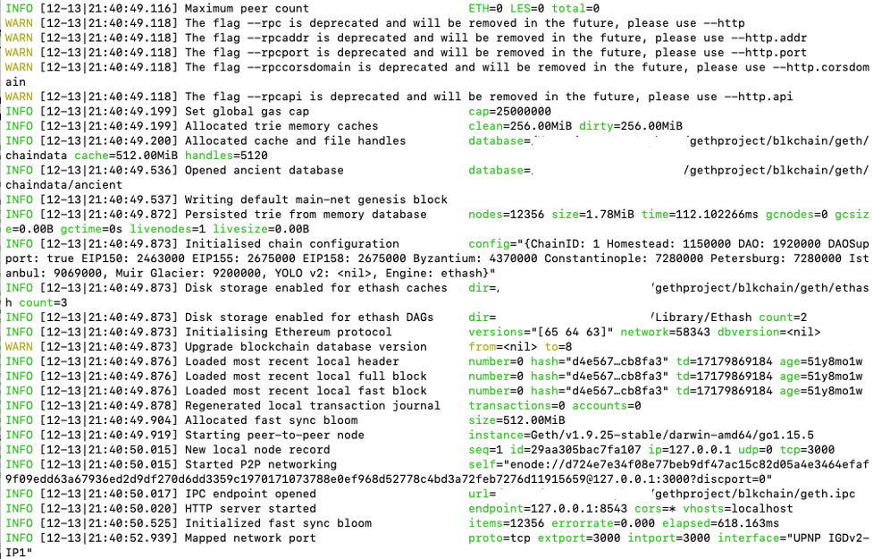
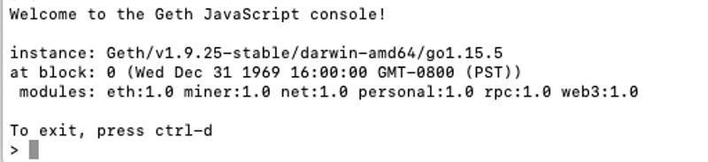
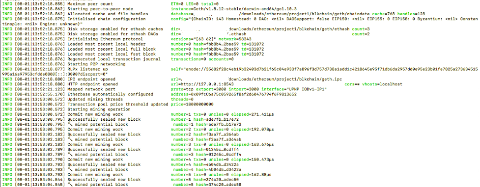
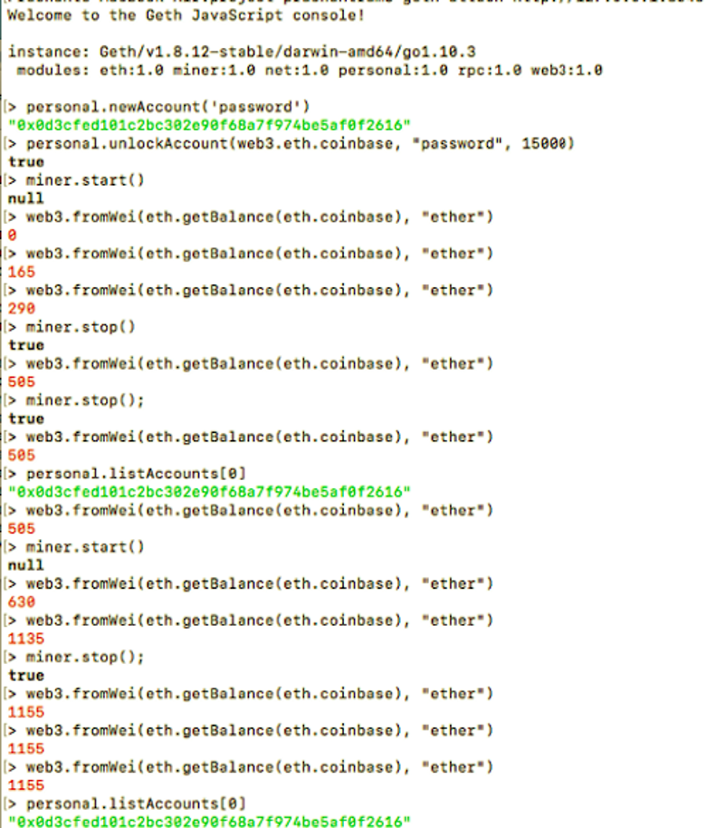

# Post-work:

## Deploy an Ethereum Private Network

For this tutorial, set up and use an **Ethereum** private blockchain using **geth** (go-ethereum) and **Truffle** for deploying the smart contract. The first part covers setting up a private network and getting it running. The second part focuses on testing the private network and finally the deployment of a stats dashboard.

Dependencies: **Truffle**, **Homebrew** and **Node/npm**. If you do not have these installed, go ahead and install them.

Homebrew installation on **MacOS**:

- Go to [www.https://brew.sh/](about:blank)
- Follow the instructions to install Homebrew - copy the following line:

	- $ /bin/bash -c &quot;$(curl -fsSL [https://raw.githubusercontent.com/Homebrew/install/HEAD/install.sh](https://raw.githubusercontent.com/Homebrew/install/HEAD/install.sh))&quot;

To install on **Windows**, please review the instructions on the [Go Ethereum](https://geth.ethereum.org/docs/install-and-build/installing-geth#install-on-windows)website and review the installation instructions.

- Open a terminal window, and from the command line, copy in the above command.
- Verify that you have the latest version:
  - $ brew --version

Install Node/npm

- Go to [https://www.npmjs.com/get-npm](https://www.npmjs.com/get-npm)
- Follow the instructions to install npm
- Verify the version
  - $ npm -v

Installing GETH:

- [Geth (go-etheruem) Client](https://geth.ethereum.org/) is a command line client interface which provides an interface to connect to the Ethereum blockchain.
- Install GETH using the below commands:

$ brew tap ethereum/ethereum

It will print out a lot of stuff, but the last lines should look like this:

$ brew install ethereum

Setup and configuration which includes:

- Configuring the genesis block
- Initiating the chain data in the blockchain
- Create a new project directory, and create the following **./genesis.json** file:
  - $ mkdir gethproject
  - $ cd gethproject
  - $ touch genesis.json
- Run **VS Code** and open the directory **gethproject**:
  - Configure the Genesis Block by copying the following into the file **./genesis.js**:

<pre><code>
{
   "config": {
   "chainId": 123,
   "homesteadBlock": 0,
   "eip150Block": 0,
   "eip155Block": 0,
   "eip158Block": 0
   },
   "alloc": {},
   "difficulty" : "0x20000",
   "gasLimit"   : "0x8880000"
}
</code></pre>

- **chainId**: A unique identifier of the new private blockchain
- **homesteadBlock**: Homestead is the first production release of Ethereum and since the developers are already using this version the value of this parameter can be left as &#39;0&#39;.
- **eip155Block/eip158Block**: EIP refers to **&quot;Ethereum Improvement Proposals&quot;**, which were implemented to release **Homestead**. In a private blockchain development hard forks aren&#39;t needed, hence the parameter value should be left as &#39;0&#39;.
- **difficulty**: controls the complexity of the mining puzzle and a lower value enables quicker mining.
- **gasLimit**: Establishes an upper limit for executing smart contracts.
- **alloc**: allows allocation of Ethers to a specific address.

- Create the folder where the blockchain will reside:
  - $ mkdir myblkchain
  - $ geth --datadir myblkchain init genesis.json

This command initializes the blockchain and where the blockchain data will be stored. This folder will grow in size as data is added to the blockchain, and if this folder is deleted the block chain will need to be reinitialized.

- Initiate and run the private Ethereum blockchain by running the following command:

	$ geth --port 3000 --networkid 58343 --nodiscover --datadir=./blkchain --maxpeers=0 --rpc --rpcport 8543 --rpcaddr 127.0.0.1 --rpccorsdomain &quot;\*&quot; --rpcapi &quot;eth,net,web3,personal,miner&quot;

Where:

— **networkid** - Identity of the private Ethereum network for other peers to discover. Use any random number, except the ones listed below, to create a private network and to prevent others from inadvertently connecting to it.

The following network id&#39;s are reserved for specific Ethereum networks.

<pre>
0: Olympic, Ethereum public pre-release testnet
1: Frontier, Homestead, Metropolis, the Ethereum public main network
1: Classic, the (un)forked public Ethereum Classic main network, chain ID 61
1: Expanse, an alternative Ethereum implementation, chain ID 2
2: Morden, the public Ethereum testnet, now Ethereum Classic testnet
3: Ropsten, the public cross-client Ethereum testnet
4: Rinkeby, the public Geth PoA testnet
8: Ubiq, the public Gubiq main network with flux difficulty chain ID 8
42: Kovan, the public Parity PoA testnet
77: Sokol, the public POA Network testnet
99: Core, the public POA Network main network
7762959: Musicoin, the music blockchain
61717561: Aquachain, ASIC resistant chain

— nodiscover - Disables the peer discovery mechanism (manual peer addition).
— datadir -  Indicates the data directory where your blockchain will reside.
— maxpeers - Maximum number of network peers (network disabled if set to 0) (default: 25)
— rpc - Enable the HTTP-RPC server
— rpcapi - Allows communication with the Ethereum network using the web3js RPC methods in the Geth Javascript console.
</pre>

- Connect to the private Ethereum blockchain using Geth Javascript console. In a new terminal window, in the **gethproject** directory, start up a Geth Javascript console on the rpc port 8543:

		$ geth attach http://127.0.0.1:8543

- Create an account and &quot;mine&quot; for dummy Ether

Use the **Geth Javascript console** web3js api&#39;s to create a new account. Use the following Geth commands to create a new account and unlock it.

\&gt; personal.newAccount(&#39;seed&#39;)

\&gt; personal.unlockAccount(web3.eth.coinbase, &quot;seed&quot;, 15000)

- Start mining dummy &quot;ether&quot; using **miner.start()** command:

\&gt; miner.start()

In the terminal window that is running Geth, it will display &quot;ether&quot; as it is being mined

- To check the balance, execute the following from the command console:
<pre>
	web3.fromWei(eth.getBalance(eth.coinbase), &quot;ether&quot;)
</pre>

- To stop mining execute:

<pre>
	miner.stop()
</pre>

Now that we have created the local blockchain using **Geth**, we can deploy the smart contract that we developed previously, the TodoList to this blockchain by modifying the **truffle-config.js** file using the port that we defined when we attached to localhost at port 8543:

<pre><code>
module.exports = {
   rpc: {
     host:"localhost",
     port:8543
   },
 
   networks: {
     development: {
       host: "localhost", //our network is running on localhost
       port: 8543, // port where your blockchain is running
       network_id: "*",
       from: "0x09fcc6a75c059265fbaf2d60476794f6f9813652", // use the account-id generated during the setup process
       gas: 20000000
     }
   };
 }
</code></pre>

Using **VS Code** , **truffle compile** and **truffle migrate** , compile and migrate your contract to the new development network that was created.