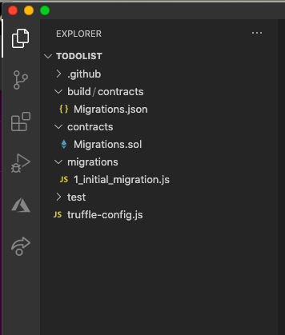
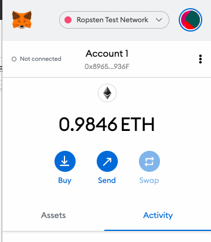

# Instructor Led Tutorial:

# Developing a **Task-Manager/TodoList** and Deploying to the **Ropsten Testnet**

### Dependencies:

- js
- Truffle
- VS code
- MetaMask
- Infura
- HDWalletProvider

Develop a simple task manager and utilize it to connect and deploy on the **Ropsten** Test Networks. For this tutorial, we will deploy to **Ropsten** using **MetaMask** with test-ether. The process for deploying requires setting up an [Infura](http://www.infura.io/) account. We will use the [TruffleSuite](https://www.trufflesuite.com/) development tools and VS Code to create, compile and deploy the smart contract first to a development network and then to the **Ropsten** testnet. Once deployed, we can use [**ropsten.etherscan.io**](https://ropsten.etherscan.io/) to inspect the blocks which have been deployed to the testnet.

The previous modules in this series walk through the entire development and deployment process for creating an Ethereum Dapp, Web front end and deploying it to a Development Network and interacting with it using **MetaMask** , **TruffleSuite** and **Drizzle** from within the **VS Code** development environment.

Rather than focus on front end development and other aspects building a Dapp, this tutorial is focused on the deployment of a smart contract to an ethereum testnet.

The [TruffleSuite](https://github.com/trufflesuite) toolkit provides support for deploying to different networks and the configuration file, truffle-config.js, provides the template for connecting to multiple networks. Previously, we have been using a development network.

- $ mkdir todolist

- $ cd todolist

- $ truffle init

- Open VS Code

- From within VS CCode, open the folder todolist

The directory structure should look like:

A review of **truffle-config.js** reveals templates for **Ropsten** and other test networks:
<pre><code>
networks: {
   // Useful for testing. The `development` name is special - truffle uses it by default
   // if it's defined here and no other network is specified at the command line.
   // You should run a client (like ganache-cli, geth or parity) in a separate terminal
   // tab if you use this network and you must also set the `host`, `port` and `network_id`
   // options below to some value.
   //
   // development: {
   //  host: "127.0.0.1",     // Localhost (default: none)
   //  port: 8545,            // Standard Ethereum port (default: none)
   //  network_id: "*",       // Any network (default: none)
   // },
   // Another network with more advanced options...
   // advanced: {
   // port: 8777,             // Custom port
   // network_id: 1342,       // Custom network
   // gas: 8500000,           // Gas sent with each transaction (default: ~6700000)
   // gasPrice: 20000000000,  // 20 gwei (in wei) (default: 100 gwei)
   // from: <address>,        // Account to send txs from (default: accounts[0])
   // websockets: true        // Enable EventEmitter interface for web3 (default: false)
   // },
   // Useful for deploying to a public network.
   // NB: It's important to wrap the provider as a function.
   // ropsten: {
   // provider: () => new HDWalletProvider(mnemonic, `https://ropsten.infura.io/v3/YOUR-PROJECT-ID`),
   // network_id: 3,       // Ropsten's id
   // gas: 5500000,        // Ropsten has a lower block limit than mainnet
   // confirmations: 2,    // # of confs to wait between deployments. (default: 0)
   // timeoutBlocks: 200,  // # of blocks before a deployment times out  (minimum/default: 50)
   // skipDryRun: true     // Skip dry run before migrations? (default: false for public nets )
   // },
   // Useful for private networks
   // private: {
   // provider: () => new HDWalletProvider(mnemonic, `https://network.io`),
   // network_id: 2111,   // This network is yours, in the cloud.
   // production: true    // Treats this network as if it was a public net. (default: false)
   // }
 },
</code></pre>

From within VS Code, create the file in the contracts directory **TodoList.sol** and copy in the following code:

<pre><code>
// SPDX-License-Identifier: MIT
pragma solidity >=0.4.22 <0.8.0;
 
contract TodoList {
 uint public taskCount = 0;
 
 struct Task {
   uint id;
   string taskname;
   bool status;
 }
 
 mapping(uint => Task) public tasks;
 
 event TaskCreated(
   uint id,
   string taskname,
   bool status
 );
 
 event TaskStatus(
   uint id,
   bool status
 );
 
 constructor() public {
   createTask("Todo List Tutorial");
 }
 
 function createTask(string memory _taskname) public {
   taskCount ++;
   tasks[taskCount] = Task(taskCount, _taskname, false);
   emit TaskCreated(taskCount, _taskname, false);
 }
 
 function toggleStatus(uint _id) public {
   Task memory _task = tasks[_id];
   _task.status = !_task.status;
   tasks[_id] = _task;
   emit TaskStatus(_id, _task.status);
 }
 
}
</code></pre>

Create a migration for the todo.sol list in the **./migrations** folder by creating a new file called **2\_deploy\_contracts.js** and copy in the following code into that file to deploy the TodoList smart contract:

<pre><code>
var TodoList = artifacts.require(&quot;./TodoList.sol&quot;);

module.exports = function(deployer) {
	deployer.deploy(TodoList);
};
</code></pre>

In the main project directory, open **./truffle-config.js** and un-comment the code to deploy on the **development network** which will be deployed to localhost port **8545**. If you prefer to use the ganache app, use port **7545** instead.

<pre><code>

 networks: {
   development: {
     host: "127.0.0.1",
     port: 8545,
     network_id: "*" // Match any network id
   }
 },

</code></pre>

Open a terminal window and start up a development blockchain using **ganache-cli** :

	 $ ganache-cli

Ganache-cli will start up a development blockchain with 10 accounts each containing 100 eth.

<pre>
Ganache CLI v6.12.1 (ganache-core: 2.13.1)

Available Accounts
==================
(0) 0x4435de4A795D4Ed751A79e487AF032eD732A2875 (100 ETH)
(1) 0xbf61c409FF52A6cCea910c08CD7A92BF2F585717 (100 ETH)
(2) 0x386716D9Cc94228E2a5aA7893B2BAaa44C39CaED (100 ETH)
(3) 0xe140e15C4dbBeD46565e7cF8ff6B8a48767dCaA5 (100 ETH)
(4) 0xcad0C56Bf72726FdccF14130e5254452eF716B7F (100 ETH)
(5) 0xF83581AA08c3c56271cD45919E18c0c16A704296 (100 ETH)
(6) 0xe4Dd9a559bd97F0f12Ae7a2B1384365d48d16e44 (100 ETH)
(7) 0xd32819C6f111b383d377ca9f9BCDf9A4f88F85Fb (100 ETH)
(8) 0xF37D01bCFf0482398394c32498754c70557F5814 (100 ETH)
(9) 0x5ada7bd27Ab5f56eB04283599EeA0bdE3E1EA669 (100 ETH)

Private Keys
==================
(0) 0x24922426c71b3a7f882c3f0f28ebdad8dfb428255a307a97049823a1113c5a82
(1) 0xe98986dcb2ae6081a0142056fff4614c025cecb4b81da6ff1098e818cfdd8423
(2) 0x85c94ec651d92a66d241cd671181f7ade2169822233db0248401221ebe85b6c4
(3) 0x455f1586d605288adbd0a4f3144553b00a23879c2e4ce0baab843fc5b7878e4d
(4) 0x036563cf4b3fdc3a56553338ec47152d57a21a02b94239398222f046453eaf86
(5) 0xbab4ec63ac4d2366383e40ba65a482f23a0058ed9a0bcda9e827676ae018a10f
(6) 0xf752304c0f67b85faf2a547901b74ae4f3a8911f7d0600f2476e37f5f6211a3d
(7) 0x52569f11ad161b01bff9babb81eff0e393ee39688c62345fc0554784bb00bb5c
(8) 0x58c739b8edaa4d6075216510175e00f2c323deb2c854ac9f1931544fdebe02ed
(9) 0xab622b48d9a81c96e07ce6c85e1c9270c405e0686eb2fc27c1b7aff598309ff9

HD Wallet
==================
Mnemonic:      foot budget pizza announce jealous venue cave remove security radio visual camera
Base HD Path:  m/44'/60'/0'/0/{account_index}

Gas Price
==================
20000000000

Gas Limit
==================
6721975

Call Gas Limit
==================
9007199254740991

Listening on 127.0.0.1:8545
</pre>

In **VS Code**, open a terminal window to compile and migrate the TodoList contract to the development network:

 $ truffle compile

$ truffle migrate --reset

<pre>
Compiling your contracts...
===========================
> Everything is up to date, there is nothing to compile.

Starting migrations...
======================
> Network name:    'development'
> Network id:      1608318160654
> Block gas limit: 6721975 (0x6691b7)

1_initial_migration.js
======================

   Replacing 'Migrations'
   ----------------------
   > transaction hash:    0xf1f71eac9ff294cdeede76e3a2ce82114227ae05566dd87a3d14258667200e12
   > Blocks: 0            Seconds: 0
   > contract address:    0x636B69aE48ae791BB106457C3214EC5645031B2C
   > block number:        46
   > block timestamp:     1608328023
   > account:             0x4435de4A795D4Ed751A79e487AF032eD732A2875
   > balance:             99.84522778
   > gas used:            191931 (0x2edbb)
   > gas price:           20 gwei
   > value sent:          0 ETH
   > total cost:          0.00383862 ETH

   > Saving migration to chain.
   > Saving artifacts
   -------------------------------------
   > Total cost:          0.00383862 ETH

2_deploy_contracts.js
=====================

   Replacing 'TodoList'
   --------------------
   > transaction hash:    0x9989ed60afd0d9932fca75c23494c19840d844095502adf31fa239a56f1f5195
   > Blocks: 0            Seconds: 0
   > contract address:    0x9f1B5Fa437055b4E525420527870DB260E4Baef6
   > block number:        48
   > block timestamp:     1608328024
   > account:             0x4435de4A795D4Ed751A79e487AF032eD732A2875
   > balance:             99.83420184
   > gas used:            508959 (0x7c41f)
   > gas price:           20 gwei
   > value sent:          0 ETH
   > total cost:          0.01017918 ETH

   > Saving migration to chain.
   > Saving artifacts
   -------------------------------------
   > Total cost:          0.01017918 ETH

Summary
=======
> Total deployments:   2
> Final cost:          0.0140178 ETH
</pre>

This will deploy the smart contracts to the development network. At this point, test your contract using the truffle console, inspect and modify the smart contracts. Below we can see that we created a single task when initializing the task list. Using **truffle console**, you can continue to interact with the contract, creating and setting tasks and toggling their status.

<pre>
truffle(development)> networks

Network: develop (id: 5777)
  Migrations: 0xbb96F04f0E31ad67F0Ef8d20f7f535f77343A498
  TodoList: 0x9f1B5Fa437055b4E525420527870DB260E4Baef6

truffle(development)> todolist = await TodoList.deployed()
undefined
truffle(development)> taskCount = await todolist.taskCount()
undefined
truffle(development)> taskCount
<BN: 1>
truffle(development)> taskCount.toNumber()
1
truffle(development)> todolist.address
'0x9f1B5Fa437055b4E525420527870DB260E4Baef6'
</pre>

## Deploying to a test network

Deploying to a test network requires **test ethers**, which do not have value. Every blockchain interaction with a smart contract costs some fees (gas) and the interaction is known as a **transaction**. To get **test ethers** use an an Ether Faucet. For the **Ropsten** test network, **test ethers** can be acquired from a **Ropsten Ethereum Faucet**.

Dependenciesfor this section are:

- **Infura** , **Metamask** , **HDWalletProvider**, **Robsten Test Ether**

If you haven’t done so already, install and set up **Metamask**.

- Installation and setting up Metamask was covered in previous modules.
- Goto the **Metamask** website to install it if you haven’t already at [www.metamask.io](www.metamask.io)

For this part of the installation, you will need to install the following in your project directory from a terminal window:
<pre>
	$ npm init
	$ npm install fs
	$ npm install @truffle/hdwallet-provider
</pre>

You may see a number of warnings but unless there are errors, they can be ignored.

### Adding Ether to MetatmaskRopsten Test Network Account

Using your **Metamask** account, connect to the **Ropsten Test Network**. If you don’t have any **test ether** already, get some **ether** from the **Ropsten Test Faucet** located at [https://faucet.ropsten.be](https://faucet.ropsten.be).

1. Open MetaMask
2. Connect to Ropsten
3. Copy the address of your account to the clipboard

4. Open a browser window or tab, and navigate to: [https://faucet.ropsten.be/](https://faucet.ropsten.be/)
5. Request ether by entering your testnet account address and clicking on the button “Send me test Ether”.

6. Go back to **Metamask** and verify that you now have **ether** in your account.

### Setting up Infura account and linking the endpoints to the Ropsten Test Network

[Infura](https://infura.io/) development suite provides instant, scalable **API** access to the **Ethereum** and **IPFS** networks. Setting up an account is easy and has no cost. A quick review of the [step-by-step tutorial](https://blog.infura.io/getting-started-with-infura-28e41844cc89/) is worth reviewing.

- Infura is a hosted Ethereum node cluster which gives users the ability to run an application on a public network. Infura gives users the ability to:
  - Interact with Ethereum networks like Robsten, Rinkeby or the Mainnet.
  - Deploy contracts to Ethereum networks.
  - Interact with contracts on Ethereum networks.
- Sign up and get started with Infura - go to [www.infura.io](http://www.infura.io/)
  - Set up an account and confirm your email address
  - Once you have an account, set up a project and select the endpoints to point to a **Ropsten** test network.
  - It should look similar to the Test Project below.

In the **Truffle** configuration file, **./truffle-config.js**,  un-comment the lines for **HDWallet Provider**, **InfruaKey**, **fs** and **mnemonic**:

<pre><code>
 const HDWalletProvider = require('@truffle/hdwallet-provider');
 const infuraKey = "fj4jll3k.....";
 
 const fs = require('fs');
 const mnemonic = fs.readFileSync(".secret").toString().trim();
</code></pre>

Go to your **infura** account, and copy the **InfuraKey** for the **endpoint** by clicking on the clipboard:

Copy the numeric part of the key to the **./truffle-config.js** - below is a sample, your key will be different:

<pre><code>
const infuraKey = &quot;4205b62c0a104f1e95d9771a48068d04&quot;;
</code></pre>

Create a file called **&quot;.secret&quot;** and copy your **mnemonic seed** to that file. The **mneumonic seed** can be found in the settings portion of your **Metamask** account. Do not share this with anyone or they will be able to access your account! If you are using **git**, include **&quot;.secret&quot;** in your **&quot;.gitignore&quot;** file.

The code below will read the seed phrase from the file **.secret** and trim all the white spaces:
<pre><code>
const mnemonic = fs.readFileSync(".secret").toString().trim();
</code></pre>

Now define the network by un-commenting the **Ropsten network** settings in **truffle-config.js** and and modifying the line referencing **infura** to include **v3/** - the standard template from truffle init has a deprecated link:  **provider: () => new HDWalletProvider(mnemonic, `https://ropsten.infura.io/v3/${infuraKey}`),**
<pre><code>
ropsten: {
   provider: () => new HDWalletProvider(mnemonic, `https://ropsten.infura.io/v3/${infuraKey}`),
   network_id: 3,       // Ropsten's id
   gas: 5500000,        // Ropsten has a lower block limit than mainnet
   confirmations: 2,    // # of confs to wait between deployments. (default: 0)
   timeoutBlocks: 200,  // # of blocks before a deployment times out  (minimum/default: 50)
   skipDryRun: true     // Skip dry run before migrations? (default: false for public nets )
 },
</code></pre>

### To deploy our to Ropsten execute the following:

$ truffle migrate --network ropsten

<pre>
Compiling your contracts...
===========================
> Everything is up to date, there is nothing to compile.

Warning: Both truffle-config.js and truffle.js were found. Using truffle-config.js.

Compiling your contracts...
===========================
> Everything is up to date, there is nothing to compile.

Starting migrations...
======================
> Network name:    'ropsten'
> Network id:      3
> Block gas limit: 8000029 (0x7a121d)

1_initial_migration.js
======================

   Deploying 'Migrations'
   ----------------------
   > transaction hash:    0x2f456acc5f842ddf0eb151742e47dd6e8ec5e48d73b1f150e2908cb56e0bf174
   > Blocks: 1            Seconds: 29
   > contract address:    0x789101d0B0Ffa4f8f87E67AF8ff8F84bD519752D
   > block number:        9398701
   > block timestamp:     1609784599
   > account:             0x896587D82C895F30433cade401068C2791A6936F
   > balance:             0.99616138
   > gas used:            191931 (0x2edbb)
   > gas price:           20 gwei
   > value sent:          0 ETH
   > total cost:          0.00383862 ETH

   Pausing for 2 confirmations...
   ------------------------------
   > confirmation number: 1 (block: 9398702)
   > confirmation number: 2 (block: 9398703)

   > Saving migration to chain.
   > Saving artifacts
   -------------------------------------
   > Total cost:          0.00383862 ETH

2_deploy_contracts.js
=====================

   Deploying 'TodoList'
   --------------------
   > transaction hash:    0xad8066308e9cc8503400c86a43674d856a71e02696e2c21b3e55f566df5afc36
   > Blocks: 0            Seconds: 8
   > contract address:    0x48112BE8d0E6e7bA892aFa2d4Ab58e9c43dd37De
   > block number:        9398706
   > block timestamp:     1609784870
   > account:             0x896587D82C895F30433cade401068C2791A6936F
   > balance:             0.98513544
   > gas used:            508959 (0x7c41f)
   > gas price:           20 gwei
   > value sent:          0 ETH
   > total cost:          0.01017918 ETH

   Pausing for 2 confirmations...
   ------------------------------
   > confirmation number: 1 (block: 9398707)
   > confirmation number: 2 (block: 9398708)

   > Saving migration to chain.
   > Saving artifacts
   -------------------------------------
   > Total cost:          0.01017918 ETH

Summary
=======
> Total deployments:   2
> Final cost:          0.0140178 ETH

</pre>

### Inspect Metamask to verify that the ether used to deploy the contract

### Verify deployment of contract on Ropsten Etherscan

Go to [ropsten.etherscan.io](ropsten.etherscan.io), enter in the contract address and inspect your contract.

Open a new terminal window within **VS Code** and similar to interacting with your contract on the ganache development blockchain, you can interact with your contract with the **truffle console**. The sample code below diplays two networks which are active. Continue to interact with and inspect transactions using **truffle consol**e and **Ropsten Etherscan**.

<pre>
$ truffle console --network ropsten
truffle(ropsten)> networks

The following networks are configured to match any network id ('*'):

    development

Closely inspect the deployed networks below, and use `truffle networks --clean` to remove any networks that don't match your configuration. You should not use the wildcard configuration ('*') for staging and production networks for which you intend to deploy your application.

Network: develop (id: 5777)
  Migrations: 0x7937f7273a9a00C298A6dA4DE6683660bd816Ae3
  TodoList: 0x1c6fAaab6d2582cb3501E665d0D86F06C51422B9

Network: ropsten (id: 3)
  Migrations: 0x789101d0B0Ffa4f8f87E67AF8ff8F84bD519752D
  TodoList: 0x48112BE8d0E6e7bA892aFa2d4Ab58e9c43dd37De
</pre>

