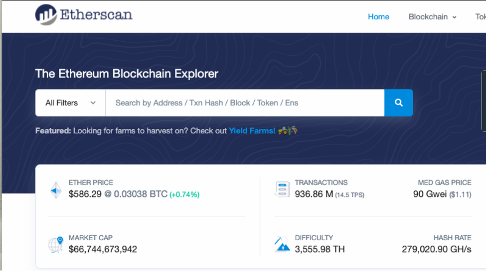
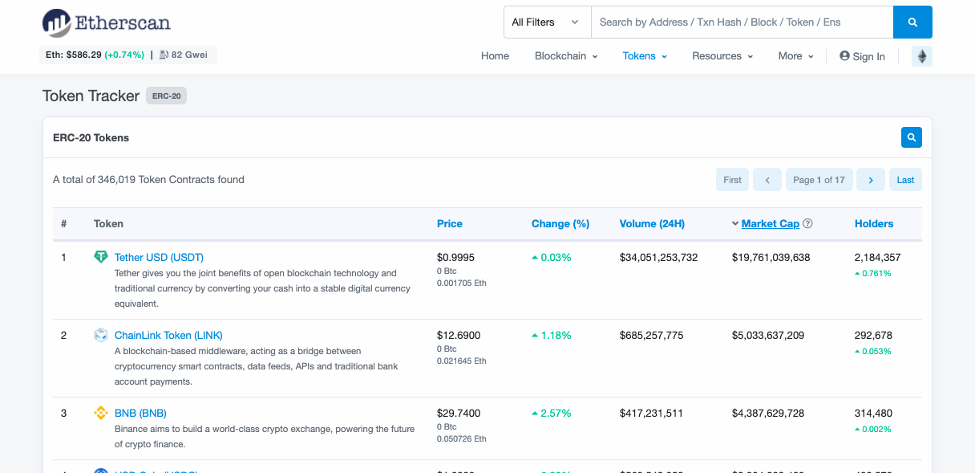
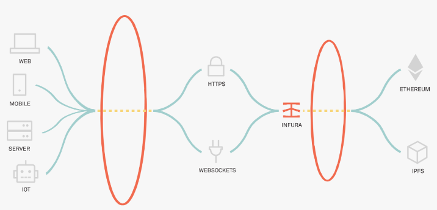
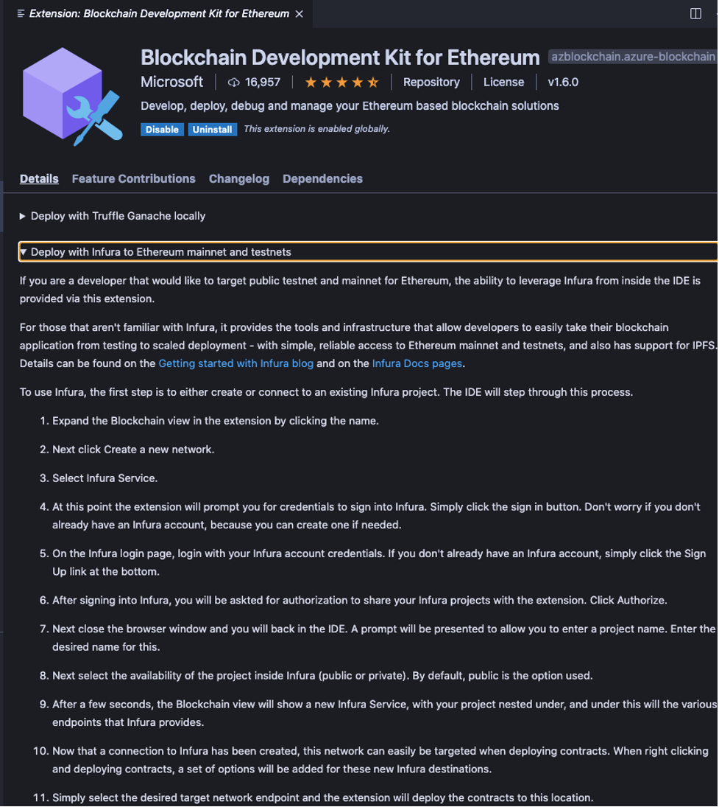
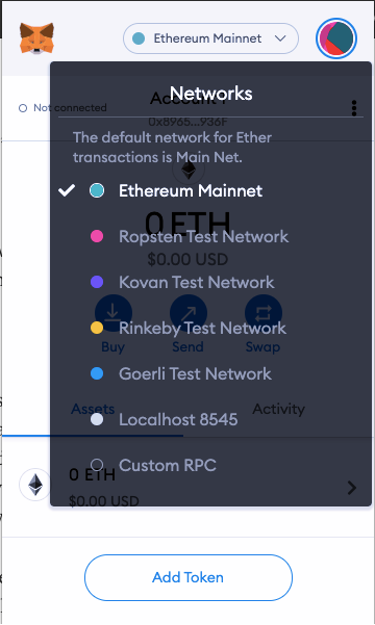

# Overview of public [Ethereum networks](https://ethereum.org/en/developers/docs/networks/)

  - [Ethereum](https://ethereum.org/en/whitepaper/) is a protocol, not a network. There can be many networks conforming to the protocol which are independent and do not interact with each other. Different Ethereum networks can have different properties, uses, functionality and consensus mechanisms.
  - There is only one public [Ethereum mainnet](https://ethereum.org/en/glossary/#mainnet).
    - Applications that are deployed to the **Ethereum mainnet** , or **mainnet** , can interoperate and interact with one another.
    - Once deployed, the applications can leverage the full potential of decentralized blockchain.
    - There is no centralized authority and **mainnet** is fully decentralized.
    - There can be different types of tokens and protocols deployed to **mainnnet**.
    - Once deployed on the mainnet, transactions are immutable and cannot be changed. In addition, each transaction has real costs associated with it which requires actual **ETH**.
    - Gas costs are represented most commonly by [**Gwei**](https://academy.binance.com/en/glossary/gwei) which is 10-9 ETH.
    - All blocks on the Ethereum **mainnet** can be viewed using [Etherscan](https://etherscan.io/) which shows the latest mined blocks and transactions. All blocks can be inspected.

Below is a list of the top ERC-20 tokens on the Ethereum mainnet:

##

## Ethereum Testnets, Faucets and Deployment

Deploying directly to **Mainnet** is not recommended and carries a large amount of associated risk. There are multiple public **Ethereum** **testnets**, each with a different deployment method and process. They are used to stage and test applications in a “live'' public environment prior to deploying a token or application to the **Ethereum** **mainnet**. **Ethereum** networks have two identifiers, a **network ID** and a **chain ID**. Although they often have the same value, they have different uses. Peer-to-peer communication between nodes uses the **network ID**, while the transaction signature process uses the **chain ID**.

### Testnet Comparison

**Testnets** allow projects to be deployed in a public setting without incurring the costs and risks associated with deploying to the **Ethereum Mainnet**. Most **testnets** require that test **eth** is accessed from **faucets**. Using a **faucet** protects the **testnet** from spam attacks since the **eth** is controlled by trusted parties. This has become the primary way to acquire **eth** for a specific **testnet**. The community manages these public test networks for the benefit of developers and testing. Let’s take a look at the different [**Ethereum** **testnets**](https://ethereum.stackexchange.com/questions/27048/comparison-of-the-different-testnets) and associated properties.

[Comparison of the different TestNets](https://ethereum.stackexchange.com/questions/27048/comparison-of-the-different-testnets):

[**Ropsten**](https://ropsten.etherscan.io/)

Proof of Work consensus protocol, closest to mainnet in functionality. Named after a Swedish subway station and has been around since 2016.

- Best reproduction of the conditions on the the **Ethereum mainnet**, and can be used with all clients.
- **Ether** for **Ropsten** can be mined or requested from a faucet:
	- Proof of Work
	- SupportsGeth and Parity clients
	- Chain Id: 3
	- Network Id: 3
	- Block time: sub-30 seconds
	- Faucet: [https://faucet.ropsten.be/](https://faucet.ropsten.be/)
	- Explorer: [https://ropsten.etherscan.io/](https://ropsten.etherscan.io/)
	- Github: [https://github.com/ethereum/ropsten](https://github.com/ethereum/ropsten)

[**Kovan**](https://kovan-testnet.github.io/website/)

Proof of authority (PoA) testnet is named after a subway station in Singapore.

* Ether can't be mined. It has to be requested from the faucet and is controlled by trusted parties. Because of this property, it is immune to spam attacks.
	* Proof of Authority
	* SupportsGeth and Parity clients
	* Chain Id: 42
	* Network Id: 42
	* Block time: 4 seconds
	* Faucet: [https://faucet.kovan.network/](https://faucet.kovan.network/)
	* Explorer: [https://kovan.etherscan.io/](https://kovan.etherscan.io/)
	* Github: [https://github.com/kovan-testnet/proposal](https://github.com/kovan-testnet/proposal)

[Rinkeby](https://www.rinkeby.io/)

Proof of Authority, PoA, testnet started by the Ethereum team in April 2017 is named after a metro station in Stockholm.

- Immune to spam attacks as **Ether** supply is controlled by trusted parties and cannot be mined, but needs to be requested from a **faucet**.
- Only supported by [Geth](https://geth.ethereum.org/)
- Doesn&#39;t fully reproduce the current production environment as it uses PoA.
	* Proof of Authority
	* SupportsGeth and Parity clients
	* Chain Id: 4
	* Network Id: 4
	* Block time: 15 seconds
	* Faucet: [https://faucet.rinkeby.io/](https://faucet.rinkeby.io/)
	* Explorer: [https://rinkeby.etherscan.io/](https://rinkeby.etherscan.io/)
	* Github: [https://github.com/ethereum/EIPs/issues/225](https://github.com/ethereum/EIPs/issues/225)
	* Website: [https://www.rinkeby.io](https://www.rinkeby.io)

[Görli](https://goerli.net/)

Proof of Authority cross-client testnet and named after a Berlin subway station. This testnet has the goal of being both widely usable across various clients and supports Clique Proof of Authority (PoA). It is robust enough to guarantee consistent availability and was started by the Goerli Initiative in 2018.

* Proof of Authority
* Supports multiple clients like Geth, Pantheon, Nethermind, and Parity
* Chain Id: 5
* Network Id: 5
* Block time: 15 seconds on average
* Faucet: [https://faucet.goerli.mudit.blog/](https://faucet.goerli.mudit.blog/)(Need to request the developers)
* Status Dashboard: [https://stats.goerli.net/](https://stats.goerli.net/)
* Explorer: [https://goerli.etherscan.io/](https://goerli.etherscan.io/)
* Github: [https://github.com/goerli/testnet](https://github.com/goerli/testnet)
* Website: [https://www.goerli.net](https://www.goerli.net)

**Ropsten** has conditions as close as possible to **mainnet** and was historically the first major **testnet**. It has had some attacks and vulnerabilities which have been addressed (DDOS and 51% attack). **Kovan**, **Goerli** and **Rinkeby** are stable and have increased usage. Generally, prior to deploying to **mainnet**, it’s advised to deploy to and test on multiple **testnets**.

### [Clients](https://ethereum.org/en/developers/docs/nodes-and-clients/#clients) and API&#39;s for deploying to **Testnets** and **Mainnet**

Ethereum is designed to offer different clients, developed by different teams using different programming languages. This makes the network stronger and more diverse. The ideal goal is to achieve diversity without any client dominating to reduce any single points of failure.

Below is a summary of some common [Ethereum clients](https://ethereum.org/en/developers/docs/nodes-and-clients/#clients):

[**Geth Client**](https://geth.ethereum.org/)

Go Ethereum (Geth for short) is one of the original implementations of the Ethereum protocol. Currently, it is the most widespread client with the biggest user base and variety of tooling for users and developers. It is written in Go, fully open source and licensed under the GNU LGPL v3.

[**OpenEthereum**](https://github.com/openethereum/openethereum) (was Parity)

OpenEthereum&#39;s goal is to be the fastest, lightest, and most secure Ethereum client. We are developing OpenEthereum using the Rust programming language. OpenEthereum is licensed under the GPLv3 and can be used for all your Ethereum needs.

[Nethermind](https://nethermind.io/)

Nethermind provides the world&#39;s fastest .NET Ethereum Client and P2P Data Marketplace, along with consulting services for those looking to build Ethereum blockchain solutions.

[Besu](https://besu.hyperledger.org/en/stable/)

Hyperledger Besu is an open-source Ethereum client developed under the Apache 2.0 license and written in Java. It runs on the Ethereum public network, private networks, and test networks such as Rinkeby, Ropsten, and Görli. Besu implements Proof of Work (Ethash) and Proof of Authority (IBFT 2.0 and Clique) consensus mechanisms.

**APIs**

[Infura](https://infura.io/)

The Infura API suite provides instant access over HTTPS and WebSockets to the Ethereum and IPFS networks. It provides a simple, easy to use interface for connecting to the endpoints of a testnet and supports **Ropsten** , **Gorli** , **Kovan** and **Rinkby**.

Infura supports both **Truffle Suite** and the **VS Code Blockchain Development Kit for Ethereum.**

[**Metamask**](https://metamask.io/)

If you have reviewed the previous blockchain modules in this series, you will already have a good understanding of **MetaMask** and how to use it. When deploying to either a **testnet** or **mainnet** , the metamask client provides a robust interface and wallet for connecting to and interacting with Ethereum blockchains. Be careful when using the Main Ethereum network, **mainnet**.

Using **MetaMask** to send **Ether** and tokens on a **testnet** is straightforward. As we&#39;ve seen in previous tutorials, the client provides an easy interface to select and use different Ethereum networks. For interacting with development networks, it&#39;s simple with **MetaMask** to connect to **Localhost 8545** or **Custom RPC** to connect with **ganache-cli** , **ganache app** and **truffle develop**. Similarly, MetaMask has predefined connections to the public testnets **Ropsten** , **Kovan** , **Rinkeby** and **Goerli**.

