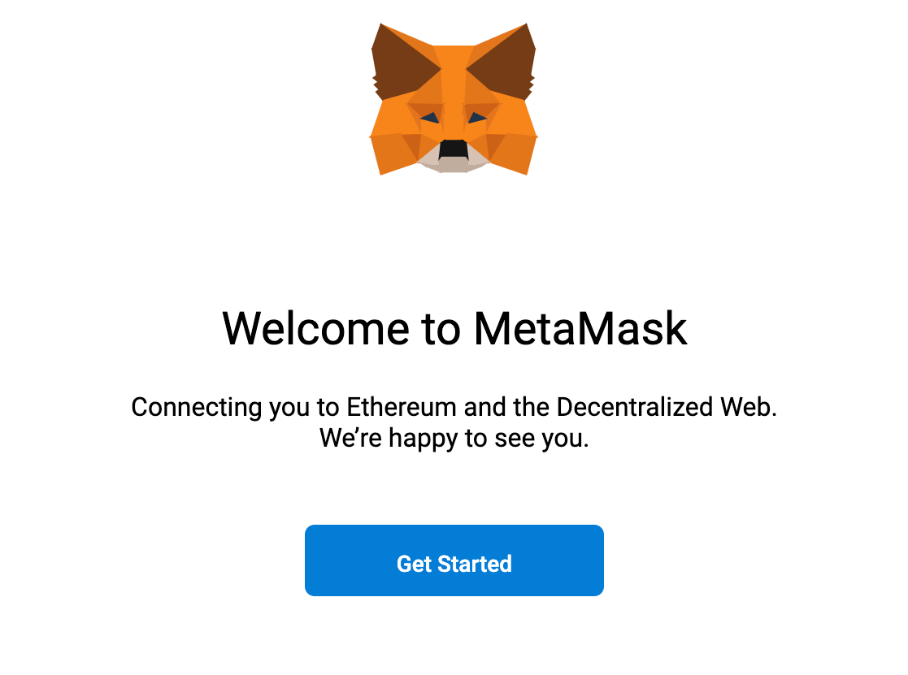
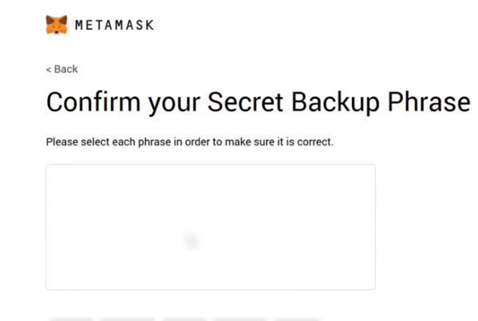

# Content

- [What is Remix?](#What-is-Remix?)
- [Get started with Remix](#Get-started-with-Remix)
- [What is MetaMask Plug-in?](#What-is-MetaMask-Plug-in?)
- [Download MetaMask](#Download-MetaMask)
- [Add MetaMask](#Add-MetaMask)
- [Get Started with MetaMask](#Get-Started-with-MetaMask)
- [Create a Wallet](#Create-a-Wallet)
- [Secret Backup Phrase](#Secret-Backup-Phrase)
- [Why do Testnets Exist](#Why-do-Testnets-Exist)
- [What is a faucet and how to use the Kovan faucet](#What-is-a-faucet-and-how-to-use-the-Kovan-faucet)
- [Request Kovan Ether](#Request-Kovan-Ether)

# What is Remix?
Remix is an online IDE (Integrated Development Environment) you can use to write smart contracts. You can compile, test and deploy them for free. You can use Remix both online and offline.

# Get started with Remix
1. Go to https://remix.ethereum.org/
2. Create a new file and name it Shipping.sol
3. Copy + paste the code from the Shipping contract (This is available in the Learn Module / Prework)[LINK TO LEARN MODULE](htttps://url_tbd.com)
4. Compile the Shipping contract
5. Choose Environment - JavaScript VM
6. Deploy the Shipping contract

Now you can test the deployed contract and its functions.

# What is MetaMask Plug-in?
Metamask itself is a cryptocurrency wallet.
Metamask also is a plug-in that will bring Ethereum to your browser. Metamask does so by making a window.web3 and window.ethereum object available that helps your browswer communicate with the blockchain.
You can choose to connect to the Main Ethereum Network as well as test networks.
As a user you can use it as a crypto wallet to store ether, and for developers it is mainly used to deploy smart contracts.
Let’s see how metamask plugin and remix work together to make smart contract development low barrier to entry and a breeze.
(NOTE: if you use MetaMask as a wallet and as a dev tool, it’ll be more secure to make 2 separate accounts)

# Download MetaMask
- Download MetaMask [here](https://metamask.io/download.html)
- Add your browser of choice (Firefox or Chrome or [Brave](https://brave.com/))

# Add MetaMask
- You will be redirected to add the extension.
Click on Add to Firefox (or Chrome)

- Click Add extension.

# Get Started with MetaMask
You will see Welcome to MetaMask. Click **Get Started**.

# Create a Wallet
If you are new to Metamask you will create a wallet and set a new password. Click **Create a Wallet**.

# Secret Backup Phrase
- Set a new password. You will now get a Secret Backup Phrase. Important! Make sure to store this Secret Backup Phrase somewhere safe since you can not get a hold of it if you do not save it.

- Confirm your Secret Backup Phrase. After this step you are done with the set up and connected to the main Ethereum network!

# Why do Testnets Exist
When we are learning how to code smart contracts, we have the option to use test nets to do transactions without paying for it.
Test nets run in parallel and are in most cases identical with the main net (the real net) but the tokens used are different (even though they might work the same way i.e. monopoly money vs real money, you can still use it to buy things but not in real life :)

This means we can learn and see how it will work in real production without spending any money.
This also means that we have NO EXCUSE to not test our contracts and audit them carefully.

There are different test nets in MetaMask, for this tutorial we will use the **Kovan test Network**.

# What is a faucet and how to use the Kovan faucet
Faucet makes it possible for you to get test ether to use for a test network. It has no real value and you are not paying anything to use it. When you have set-up MetaMask you can change from **Main Ethereum Network** to **Kovan Test Network**.

# Request Kovan Ether
- You can request Kovan Ether through your GitHub or Twitter account
- You will need your address from MetaMask
- You can submit your address here: https://faucet.kovan.network/ using your GitHub account.
- You can also get Kovan Ether through Gitter by using GitLab, Twitter or GitHub as a login. [Here](https://gitter.im/kovan-testnet/faucet) you will paste your address in a chat to request ether
- More information about Kovan Faucet can be found [here](https://github.com/kovan-testnet/faucet/blob/master/README.md)

