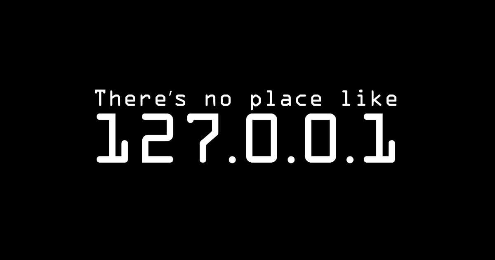

# Web basics

## How the web works

So what is this magical web? We use it every day, but we may not fully understand exactly what it is and how it works. As future web developers and general humans who use the internet daily, it's important to have a concrete understanding of the foundations of the web. Let's start by defining some terminology.

- The [World Wide Web](https://en.wikipedia.org/wiki/World_Wide_Web), or simply the web, is likely the most common and popular component of the internet, so much so the names are often used interchangeabl.
- The [Internet](https://en.wikipedia.org/wiki/Internet) is a large **network of connected computers** communicating with one another. Several services are carried across the internet, including email, messaging, and the web. At a relatively low level, the internet is made up of computers that we call **clients** and **servers**.

**Clients** are the typical web user's internet-connected devices (for example, the computer you are on right now connected to your wi-fi or your phone), and the web browsers on those devices (e.g. Edge, Safari, Chrome, or Silk).  

**Servers** are computers that store web pages or applications. They are computers, just like the machine you are on right now, although typically without the keyboard, trackpad, or screen. When a **client** wants to access a web page (like Bing or LinkedIn), a copy of the web page is downloaded from the server onto the client machine to be displayed in the user's web browser.

In simpler words, the client makes a **request** and the server answers back with a **response**. But we'll get into the request-response cycle in a little bit.

## So What Actually Happens

Let's say you want to learn more about clients and servers (because I'm sure you do!) so you open a browser and type into the address bar [www.bing.com](https://www.bing.com).

1. Your browser goes to the Domain Name Server or DNS (think of this like an address book or phone book) and finds the _real_ address, or Internet Protocol (IP) address of the Bing server that the website lives on. The **IP address** is typically indicated as a series of four period-separated numbers like 52.33.229.159.
1. The browser sends a **request** message to Bing's servers asking it to send a copy of the website back to you, the client. To get a little lower level, the request is made using a specific type of [protocol](https://en.wikipedia.org/wiki/Communication_protocol), or agreed upon series of signals, known as [Hyptertext Transfer Protocol or HTTP](https://en.wikipedia.org/wiki/Hypertext_Transfer_Protocol).
1. Provided don't have to login and are able to access the page, Bing's servers approve the your request and responds by sending the website's files back to the browser as a series of small chunks called data packets.
1. The browser assembles the small chunks into a complete website and displays the Bing homepage to you.

And there you have it! That's the magic of the internet!

## What is a URL

While surfing the web you have likely heard the term URL thrown around. URL stands for [Uniform Resource Locator](https://en.wikipedia.org/wiki/URL) and this is a reference to a resource that is on the web. As users, we enter in a URL and expect to get a resource back. When we enter in the URL of https://www.linkedin.com we expect to get LinkedIn's homepage back as a resource that was located.

There are two parts to a given URL - the protocol and the address. [HTTPS](https://en.wikipedia.org/wiki/HTTPS) is the protocol identifier, www.linkedin.com is the resource name.

### The significance of the S

You may notice the trailing **s** on the protocol, and might be wondering what it is. The **s** stands for **secure**. While the process is seemless, and you won't necessarily notice any difference, there's quite a bit going on behind the scenes. When using **https** as opposed to **http**, your information will be encrypted, protecting it from other parties. In addition, your browser will ensure you are accessing the site you were expecting, and not another site masquerading as your destination.

## About that IP address

**IP Address** is probably another one of those tech buzzwords you may have heard here and there. It may look and sound intimidating, but an IP address is simply one computer's unique identifying address. IP addresses allow the location of literally billions of digital devices that are connected to the Internet to be pinpointed and differentiated from other devices! Just like how your home needs a unique mailing address to send you a letter, a remote computer needs your unique IP address to communicate with your computer. So why is it that we type in something like www.linkedin.com, instead of LinkedIn's actual IP address (which is currently 144.2.12.1, but may change from time to time)? It would be extremely difficult for any reasonable person to remember the actual IP address of all of their favorite websites, so we point the IP address to a domain name. When you type in www.linkedin.com, your web browser visits something called the DNS (Domain Name Server), which acts like a phone book. The DNS finds the domain name of www.linkedin.com, matches it with the correct IP address, and sends the request to LinkedIn's servers!

## Localhost - a special address

Localhost is just like any other name, but different. The difference between localhost and any other URL like www.linkedin.com is localhost traffic never travels on a network. Data is transmitted in your computer - hence the word "local". Your computer has many different network ports, which are used to give different access rights to different hosted files. Your localhost is unique in that it is assigned to your computer. When using localhost, your machine is both the client and the server! Translated into an IP address, a localhost is always designated as 127.0.0.1.

Localhost is the perfect tool for developers building web applications because it allows you to view your web page during the development process all the way up until it is ready for production.

## What you've learned

In this section you learned about servers and clients and how they use a protocol called HTTP to connect. You also learned with how IP addresses and URLs work together and what it means to run a localhost on your home computer. In the next section we will discuss the HTTP Request and Response Cycle.

Next: [Request and Response Cycle.](./req_resp.md)
