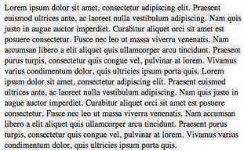

# The Display Property

Not all tags are created equal. As a result, not all tags are displayed the same way. Understanding how a tag will display by default allows you to better control page layout. Each HTML element is displayed as either `block` or `inline`.

## inline

`inline` items only use as much space as needed. Consider the following HTML:

``` html
<span><a href="https://www.microsoft.com/">Microsoft</a> created <a href="https://code.visualstudio.com">Visual Studio Code</a>. Isn't that <strong>cool?!</strong></span>
```

This will display:

[Microsoft](https://www.microsoft.com) created [Visual Studio Code](https://code.visualstudio.com). Isn't that **cool?!**

Some examples of inline elements are `<a>`, `<span>`, `<input>`, `<label>`, `<select>`, and `<textarea>`.

## block

`block` items take up 100% of the width of the parent element. Even if the width of the element is less than the parent, the element will take up 100% of the width of the parent. The most common side effect of this is that the element will add a new line before and after the element.

Consider the following HTML:

``` html
<table>
  <tr>
    <th>Column</th>
  </tr>
  <tr>
    <td>
      <div>Hello</div>
      <div>World</div>
    </td>
  </tr>
</table>
```

This will generate:

| Column           |
| ---------------- |
| Hello<br />World |

Some examples of block elements include `<div>`, `<form>`, `<h1>`-`<h6>`, `<p>`, `<table>`, `<ul>`, `<ol>`, and `<li>`.

## Interaction between inline and block elements

While it's valid to put inline elements inside block elements (an `a` works just fine in a `div`), block elements are **not** allowed inside inline elements (you couldn't put a `div` inside an `a`).

## Controlling the display

We can, however, change the default display style of HTML elements using CSS.

### Changing inline to block

`inline` is the default for `span` elements. As a result, this HTML:

``` html
<span>One</span>
<span>Two</span>
<span>Three</span>
```

Will result in this output:

``` text
OneTwoThree
```

If we change our `span` to be `block`, we notice we get white space. This CSS:

``` css
span {
  display: block;
}
```

Will render this result on the same HTML:

``` text
One
Two
Three
```

### Changing block to inline

On the reverse, suppose we have the following navigation menu:

``` html
<ul id="nav-menu">
  <li><a href="#">Home</a></li>
  <li><a href="#">Dashboard</a></li>
  <li><a href="#">About</a></li>
  <li><a href="#">Contact Us</a></li>
</ul>
```

The HTML would normally appear like this:

- _Home_
- _Dashboard_
- _About_
- _Contact Us_

Let's say we want to use a list but display it as a horizontal menu across the top of our page. We could use the following CSS:

``` css
#nav-menu{
  list-style-type: none; /*This gets rid of the bullets.*/
}
#nav-menu li {
  display: inline;
}
```

Now we'd see:

_Home_ _Dashboard_ _About_ _Contact Us_

### Using inline-block

`inline-block` is a combination of `inline` and `block`, as you might expect. Each element remains a `block`, but similar to `inline`, only uses the width necessary to display the information. This is probably best explained with an example.

Let's start with the following HTML (which we'll use for all examples):

``` html
<p>Lorem ipsum dolor sit amet...</p>
<p>Lorem ipsum dolor sit amet...</p>
```

Let's set some colors for display purposes:

``` css
p {
  padding: 20px;
  margin: 20px;
  width: 350px;
  font-size: 14px;
  background: #eee;
}
```

This will display two separate blocks because `p` is `block` by default.


If we change the display to `inline`, we'll get two paragraphs running together--not really what we want:

``` css
p {
  padding: 20px;
  margin: 20px;
  width: 350px;
  font-size: 14px;
  background: #eee;
  display: inline;
}
```



Let's see if we can get them to display side-by-side. This is where `inline-block` comes into play. Each paragraph will remain as a `block`, and so will display separately. However, any horizontal space left on the browser will be free to be used by other `inline-block` elements, thus behaving like `inline`:

``` css
p {
  padding: 20px;
  margin: 20px;
  width: 350px;
  font-size: 14px;
  background: #eee;
  display: inline-block;
}
```


Pretty cool, huh? What's happening is that we're telling the browser to display the paragraphs inline, but allowing them to retain their block-level characteristics. This means we can manually set a width and height and keep the two elements distinct but also have them appear next to each other in the document flow.

## What you learned

In this section, you learned that the display property is one of the most critical properties within CSS. You also learned that block elements use the entire width of the screen, and inline elements will fill the width of the screen with as many elements that will fit into the screen width.

NEXT: [Box Model](./box_model.md)
