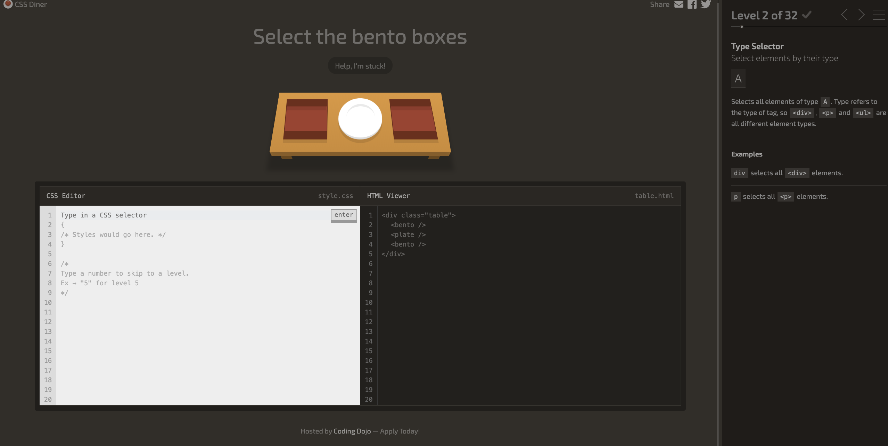

# Activity: Dojo Diner

## Welcome to the CSS Dojo Diner!

The goal of this activity is to get familiar with how CSS works and see what it can do.

To do this activity, add the CSS code necessary to select the elements that each panel asks for. There is a help button you can use if you need assistance finding the right CSS element for each level.

### [Begin the activity.](http://algorithms.dojo.news/static/dojo-diner/index.html)

Complete this activity with a partner!

Next: [Styling Elements](./styling_elements.md)
